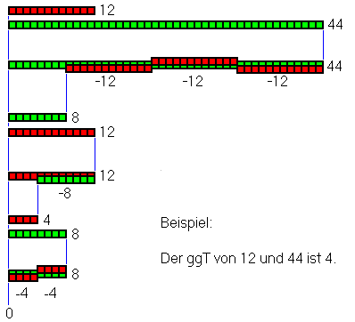
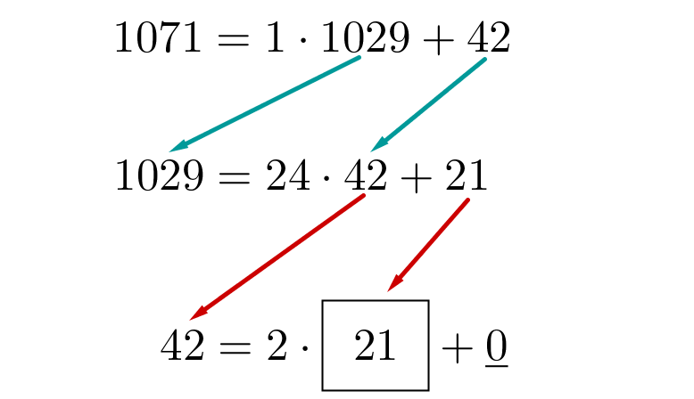
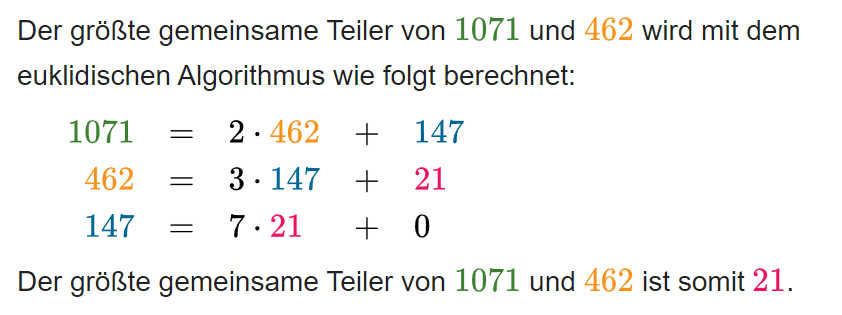
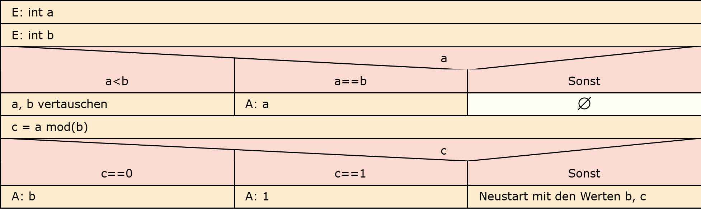

---
aliases:
  - 3aAPC_A1 Algorithmus
cssclasses: 
tags:
  - 3aAPC/Inf
  - ToDo/Finish
  - ToDo/Submit
date: 2024-11-13
deadline: 2024-11-14
hideFromQuery: false
link:
  - https://www.eduvidual.at/mod/assign/view.php?id=6816844
---
# Algorithmus 
---
- Autor: Ingo Schlapschy
- Schuljahr: 2024/25
- Lehrgang: 2
- Klasse: 3aAPC
- Gruppe: C
- Fach: Informatik
- Datum: 
	- 2024-11-13
	- 2024-11-14
---
Inhaltsverzeichnis

> [!Index]
> - [Angabe](#angabe)
> 	- [ToDo](#todo)
> - [Lösung](#l%C3%B6sung)
> 	- [Definition Algorithmus](#definition-algorithmus)
> 	- [Eigenschaften eines Algorithmus](#eigenschaften-eines-algorithmus)
> 		- [Statische Finitheit](#statische-finitheit)
> 		- [Ausführbarkeit](#ausf%C3%BChrbarkeit)
> 		- [Dynamische Finitheit (Platzkomplexität)](#dynamische-finitheit-platzkomplexit%C3%A4t)
> 		- [Terminierung (Zeitkomplexität)](#terminierung-zeitkomplexit%C3%A4t)
> 		- [Determiniertheit](#determiniertheit)
> 		- [Determinismus](#determinismus)
> 	- [Euklidischer Algorithmus](#euklidischer-algorithmus)
> 		- [Bilder](#bilder)
> 		- [1. Schritt: Rest berechnen](#1-schritt-rest-berechnen)
> 		- [2. Schritt: Überprüfen ob man fertig ist](#2-schritt-%C3%9Cberpr%C3%BCfen-ob-man-fertig-ist)
> 		- [3. Schritt: mit neuen Zahlen (a2, b2) wiederholen](#3-schritt-mit-neuen-zahlen-a2-b2-wiederholen)
> 	- [Notizen aus dem Unterricht](#notizen-aus-dem-unterricht)
> 		- [Größter gemeinsamer Teiler (ggT)](#gr%C3%B6%C3%9Fter-gemeinsamer-teiler-ggt)
> 		- [Primzahlen](#primzahlen)
> 		- [Beispiele für Algorithmen](#beispiele-f%C3%BCr-algorithmen)
> 		- [Darstellungsformen von Algorithmen](#darstellungsformen-von-algorithmen)
> 		- [Kontrollstrukturen](#kontrollstrukturen)
> 	- [Struktogramm](#struktogramm)
> 	- [Quellen](#quellen)

---
## Angabe

> [!Original] 
> 1. Erstellen Sie ein Deckblatt, Inhaltverzeichnis für ihre Mitschrift.
> 2. Fügen Sie eine Zusammenfassung über das Thema Algorithmus hinzu.
> 3. Versuchen Sie die Grafik zu interpretieren und erstellen Sie ein Struktogramm zu diesem Algorithmus.

### ToDo
- [x] Erstellen Sie ein Deckblatt, Inhaltverzeichnis für ihre Mitschrift. 
- [x] Fügen Sie eine Zusammenfassung über das Thema Algorithmus hinzu.
- [x] Versuchen Sie die Grafik zu interpretieren und erstellen Sie ein Struktogramm zu diesem Algorithmus.
## Lösung
### Definition Algorithmus
- Ein klar definierter Ablauf (Kochrezept)
- Löst ein (klar definiertes) Problem
- mit einer endlichen Anzahl von Schritten

> [!Def.: Algorithmus] 
> Eine Berechnungsvorschrift zur Lösung eines Problems heißt genau dann Algorithmus, wenn eine zu dieser Berechnungsvorschrift äquivalente Turingmaschine existiert, die für jede Eingabe, die eine Lösung besitzt, stoppt

### Eigenschaften eines Algorithmus
#### Statische Finitheit
- Verfahren muss eindeutig beschreibbar sein
  (Anleitung darf nicht unendlich lang sein)
#### Ausführbarkeit
- Jeder Schritt des Verfahrens muss tatsächlich ausführbar sein
#### Dynamische Finitheit (Platzkomplexität)
- Verfahren kommt mit endlich viel Speicherplatz aus
#### Terminierung (Zeitkomplexität)
- Verfahren hat immer endlich viele Schritte
	- terminierend... hält an oder bricht ab
	- nicht-terminierend... kann in Endlosschleife enden
#### Determiniertheit
- Bei gleichen Startparameter führt der Algorythmus immer zum selben Ergebnis
#### Determinismus
- Der nächste Schritt ist zu jedem Zeitpunkt klar definiert
### Euklidischer Algorithmus
Der Algorithmus wird anhand von folgenden Bildern veranschaulicht
#### Bilder
[Euklidischer_Algorithmus_ohne.png (398×362)](https://www.eduvidual.at/pluginfile.php/7780313/mod_resource/content/1/Euklidischer_Algorithmus_ohne.png)
	
[euklidischer Algorithmus / Ziffern Bsp. 1 Datei](https://www.eduvidual.at/mod/resource/view.php?id=6816845)
	
[euklidischer Algorithmus / Ziffern Bsp. 2 Datei](https://www.eduvidual.at/mod/resource/view.php?id=6830521)
	
#### 1. Schritt: Rest berechnen
Hat man 2 Zahlen (o.B.d.A.) a1, b1
	a1, b1 ... aus den Natürlichen Zahlen
So sei c1 = a1 mod(b1)
#### 2. Schritt: Überprüfen ob man fertig ist
Ist c1 == 0, so ist a der ggT
Ist c1 == 1, so ist 1 der ggT
Ist c1 > 1, so führe den [3. Schritt](#3.%20Schritt%201.%20Schritt%20mit%20neuen%20Zahlen%20wiederholen) durch
#### 3. Schritt: mit neuen Zahlen (a2, b2) wiederholen
Beginne wieder beim [1. Schritt](#1.%20Schritt%20Rest%20berechnen) mit folgenden Werten:
- a2 = b1
- b2 = c1

> [!NOTE] Für jeden weiteren Schritt gilt:
> a(i+1) = b(i)
> b(i+1) = c(i)

### Notizen aus dem Unterricht
#### Größter gemeinsamer Teiler (ggT)
- natürliche Zahl a die der größte Teiler von zwei natürlichen Zahlen sowohl b als auch c ist.
- zerlegt man die Zahl in ihre Primzahlen (Primfaktorenzerlegung) so ist das Produkt der übereinstimmenden Primfaktoren der ggT.
- Sonderfälle
	- Ist die größere Zahl eine Primzahl ist der ggT = 1
	- Ist die kleinere Zahl eine Primzahl gilt 
		- ggT = 1 oder 
		- ggT = ist die kleinere Zahl selbst
##### Beispiele mit Primzahlen
- 7, 9 ... kleinere Zahl ist Prim
	- 9 mod(7) = 2
	- 7 mod(2) = 1
	- -> ggT = 1
- 7, 14 ... kleinere Zahl ist Prim
	- 14 mod(7) = 0
	- -> ggT = 7
- 12, 47 ... größere Zahl ist Prim
	- Primfaktorenzerlegung
		 $$
		 \begin{align}
		12&=(3)^1*(2)^2=3*2*2\\
		47&=(47)^1=47
		\end{align}
		$$
	- Es kann keinen gemeinsamen Teiler geben
	- Der einzige (nichttriviale) Teiler der Primzahl ist die Primzahl selbst
	- Diese Zahl kann __nie__ Teiler der kleineren Zahl sein
		- (Da sie größer ist als die kleinere Zahl)
	- d.h.: ggT = 1
#### Primzahlen
- Eine natürliche Zahl
- hat genau 2 Teiler (in den natürlichen Zahlen)
	- 1
	- die Primzahl selbst
- z.B.: 2, 3, 5, 7, 11, 13, 17, 19, 23, 29, 31, 37, 41, 43, 47
#### Beispiele für Algorithmen
- Kochrezepte (Kaffee/Tee)
- Sortieralgorithmen
	- Bubble Sort
	- Quick Sort
	- Merge Sort
	- Bogo Sort
		- erfüllt terminierung nicht -> kein richtiger Sortieralgorithmus 
- Suchalgorithmen
	- Linear Search
	- Binary Search
#### Darstellungsformen von Algorithmen
- grafisch
	- Struktogramm
	- Flussdiagramm
		- PAP (Programm Ablauf Plan)
- schriftlich
	- Pseudocode/Programmiersprache
	- Beschreibung
#### Kontrollstrukturen
- Ein Algorithmus beinhaltet prinzipiell
	- Anweisungen
	- Kontrollstrukturen
		- Sequenz/Folge
		- Selektion
		- Iteration
		- Unterprogramm
### Struktogramm

### Quellen
- [Algorithmus - Wiki markiert Datei](https://www.eduvidual.at/mod/resource/view.php?id=6816841)
- Zusatzinfos: 
	- [Algorithmus Darstellung Einstieg Datei](https://www.eduvidual.at/mod/resource/view.php?id=6816847)  