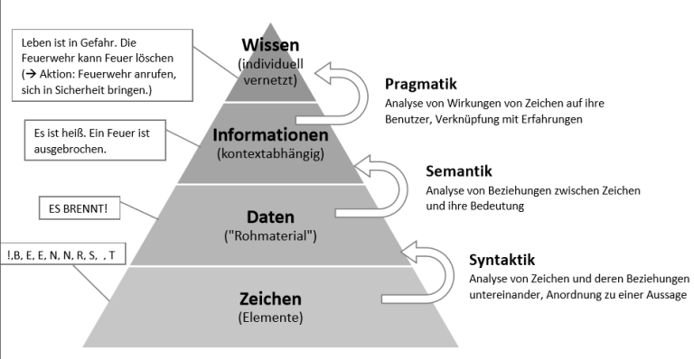
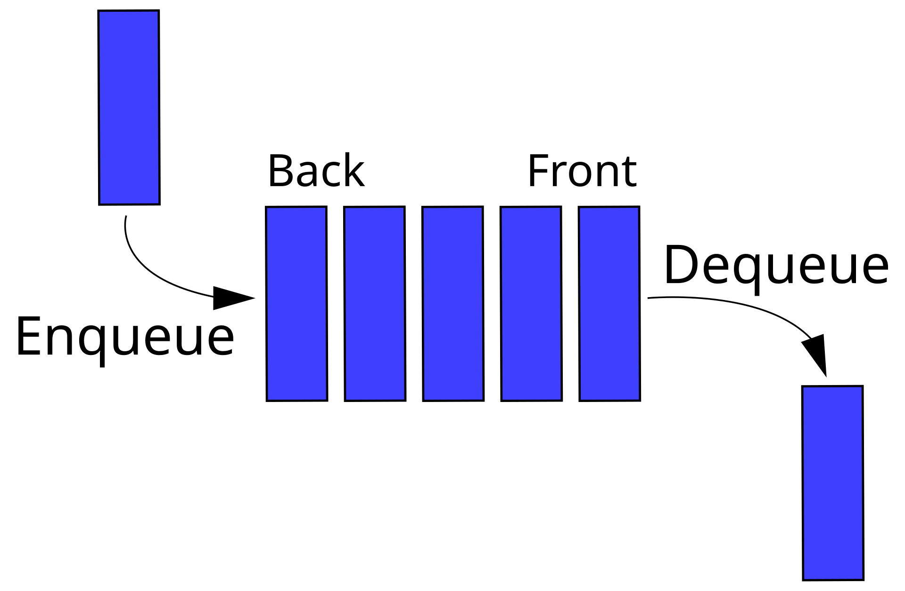
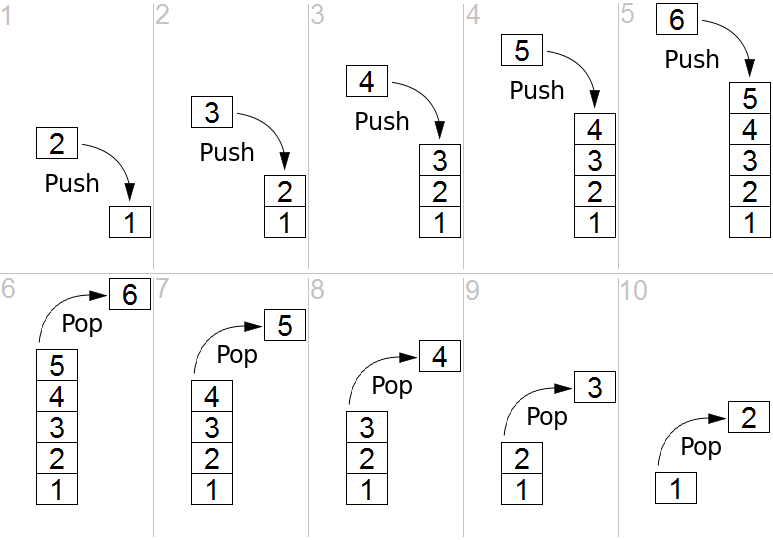
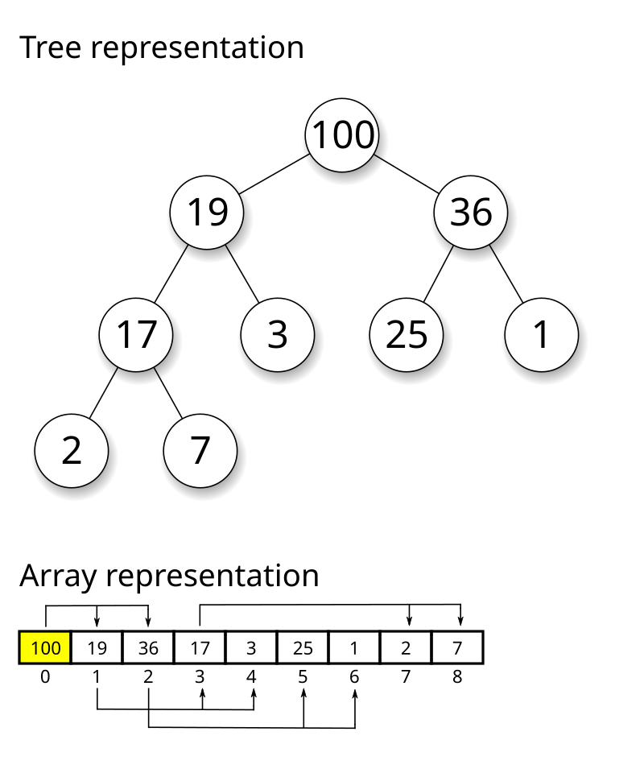
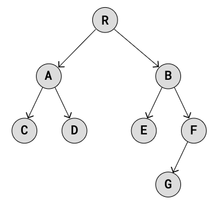

---
aliases:
  - Datenstuktur
cssclasses: 
tags:
  - 3aAPC/Inf
  - ToDo/Finish
  - ToDo/Submit
date: 2024-11-14
deadline: 2024-11-14
hideFromQuery: false
link:
  - https://www.eduvidual.at/mod/assign/view.php?id=6816852
info: Java Framework & Hashtables noch nicht verstanden -> besser ausarbeiten
---
# Datenstrukturen 
---
- Autor: Ingo Schlapschy
- Schuljahr: 2024/25
- Lehrgang: 2
- Klasse: 3aAPC
- Gruppe: C
- Fach: Informatik
- Datum: 2024-11-14
---
1. [Angabe](#angabe)
	1. [ToDo](#todo)
2. [Was ist eine Datenstruktur?](#was-ist-eine-datenstruktur)
3. [Daten-Typen](#daten-typen)
4. [Gängige Struktur-Typen](#g%C3%A4ngige-struktur-typen)
	1. [Datensatz (Tupel/Record)](#datensatz-tupelrecord)
	2. [Array](#array)
	3. [Linked List](#linked-list)
	4. [Queue](#queue)
	5. [Stack](#stack)
	6. [Heap](#heap)
	7. [Graph](#graph)
	8. [Baum](#baum)
	9. [Hashtable](#hashtable)
5. [Java Collections Framework](#java-collections-framework)
	1. [Datentypen](#datentypen)
6. [Notizen aus dem Unterricht](#notizen-aus-dem-unterricht)
7. [Quellen](#quellen)
## Angabe

> [!NOTE]
> Erstellen Sie eine [Übersicht](https://www.eduvidual.at/mod/page/view.php?id=6816898 "Übersicht") über Grundlegende [Datenstrukturen](https://www.eduvidual.at/mod/page/view.php?id=4528025 "Datenstrukturen"). 
> 
> - Was versteht man unter Datenstruktur?
> - Welche Grunddatentypen gibt es? (mit Speicherbedarf)  
>     
> - Wer übernimmt die Verwaltung der Daten im Speicher/auf der Festplatte?  
>     
> - Erstellen Sie eine [Übersicht](https://www.eduvidual.at/mod/page/view.php?id=6816898 "Übersicht") gängiger Datenstrukturen inkl. kurzer Beschreibung derer Eigenschaften (Array, Queue, Stack, Heap, Graph, Baum, Hashtable)
> - Geben Sie die jeweiligen Java Klassen aus dem **Java Collections [Framework](https://www.eduvidual.at/mod/resource/view.php?id=6816895 "Framework")** an. Die wichtigsten Methoden inkl. kurzer Beschreibung sollten auch nicht fehlen.
> 
> Quelle:   [https://de.wikipedia.org/wiki/Datenstruktur](https://de.wikipedia.org/wiki/Datenstruktur)

### ToDo
- [x] Erklärung Datenstruktur
- [x] Übersicht Grunddatentypen (mit Speicherbedarf)
- [x] Verwaltung der Daten im Speicher/auf Festplatte
- [ ] Übersicht Datenstrukturen (Java Collections Framework)
	- [ ] Beschreibung d. Eigenschaften
	- [ ] wichtigste Methoden
	
## Was ist eine Datenstruktur?
> [!NOTE] Def.: Datenstruktur
> - Die Struktur, mit der Daten angeordnet und verknüpft werden.
> - Unterschiedliche Datenstrukturen
> 	- haben Einfluss auf die Effizienz mit der die Daten gefunden, gelesen, geschrieben werden können
> 	- unterscheiden sich in den möglichen Operatoren für die einzelnen Datensätze
> 	- haben unterschiedlichen Speicherbedarf
- [Grafik Pyramide Datenstruktur](https://www.eduvidual.at/pluginfile.php/7765572/course/section/3377753/1532026350.png)
	
	
## Daten-Typen
nicht verwechseln mit Daten-Strukturen
Details sind abhängig von Umgebung
- True/False
	- Boolean
- Speicheradresse
	- Pointer
- Ganzzahlen
	- Integer 
- Gleitkommazahlen
	- Float
- Symbol
	- Char
- Text
	- String
## Gängige Struktur-Typen
### Datensatz (Tupel/Record)
- Einfachste Datenstrukturen
- Folge von Werten
- z. B. Zeile einer Tabelle
### Array
- Menge von Werten
	- alle haben den selben Datentypen
- Kann Gut:
	- auf Elemente Zugreifen
- Kann NICHT Gut:
	- Elemente Hinzufügen
	- Elemente Entfernen
- Anzahl der Werte oft NICHT änderbar
	- Der Wert selbst ist schon veränderbar
- Alle Daten des Datensatzes in einem Block
- Lineare Datenstruktur
### Linked List
- Menge von Werten
	- können unterschiedliche Datentypen besitzen
- Kann Gut:
	- Element hinzufügen
	- Element löschen
- Kann NICHT Gut:
	- auf Elemente zugreifen
- Singly Linked List
	- An Ende von Datensatz ist der Link (pointer) zu nächstem Datensatz hinterlegt
		- Quasi eine Schlange A->B->C->D->...
- Doubly Linked List
	- Element hat zusätzlich auch link zu vorherigem Element
		- Mehr Speicherbedarf
		- Rückwärtige Suche möglich
- Lineare Datenstruktur

### Queue

- Sonderform der Liste
	- Kann als Array oder Linked List umgesetzt werden
- FIFO
	- First In
	- First Out
	- der älteste Datensatz wird zuerst abgegriffen
- Befehle
	- Offer
### Stack
- Sonderform der Liste
	- Kann als Array oder Linked List umgesetzt werden
- LIFO
	- Last In
	- First Out
	- der neueste Datensatz wird zuerst 
- Befehle
	- Push
		- Neues Element am Anfang vom Stack hinzufügen
		- Oben Drauf legen
	- Pop
		- Erstes Element entfernen
		- Oben runter nehmen
	- Top
	- Offer
		- Neues Element am Ende vom Stack hinzufügen
		- Unten Reinlegen
	- Poll
		- Letztes Element 
	

### Heap

- Baum-Struktur mit Priorisierung 
	- Höherer Index -> Höhere Priorität
- Knotenpunkte stehen in Parent/Child Beziehung zueinander
	- 1 Parent (P) hat 
	- 0-n Children (C)
- Verhältnis der Indexwerte zw. Parent und Child
	- Index(P)>Index(C)
- Kann Suche Beschleunigen
### Graph

- Die Verbindung selbst ist (teil) der Information
- Knotenpunkte können Verbindungen zu mehreren anderen Knotenpunkten haben
### Baum

- Knotenpunkte stehen in Parent/Child Beziehung zueinander
	- 1 Parent (P) hat 
	- 0-n Children (C)
### Hashtable
- ein "Dictionary"-Array wird erstellt
- dieses wird als "Index" verwendet
- Damit lassen sich Inhalte schneller suchen
## Java Collections Framework
### Datentypen
- Grafik
	- 
	- 

## Notizen aus dem Unterricht
- Wer übernimmt die Speicherung der Datenstruktur auf der Festplatte/im Arbeitsspeicher
	- Für die Festplatte: Das Dateisystem (FAT32, Btrfs, NTFS, etc.)
	- Für den Arbeitsspeicher: Das Betriebssystem

## Quellen
- [Datenstruktur – Wikipedia](https://de.wikipedia.org/wiki/Datenstruktur)
- [Arrays vs Linked Lists - Computerphile](https://www.youtube.com/watch?v=DyG9S9nAlUM)
- [Collection Framework](https://www.javatpoint.com/collections-in-java)