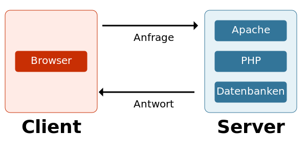
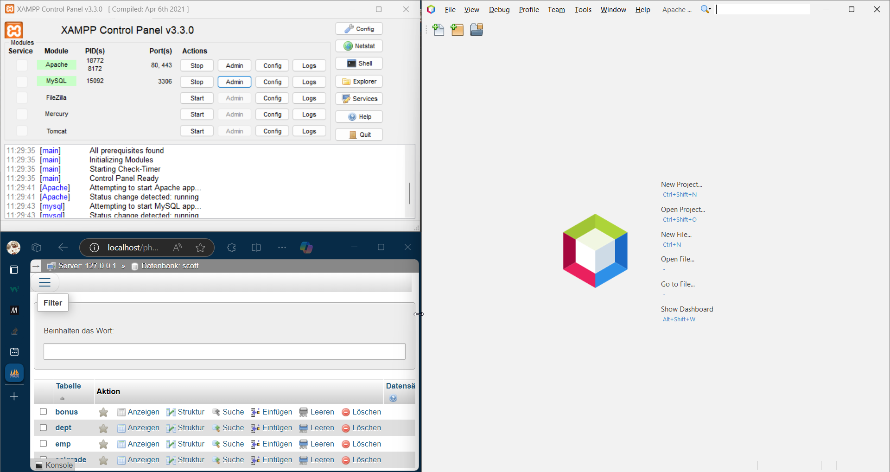
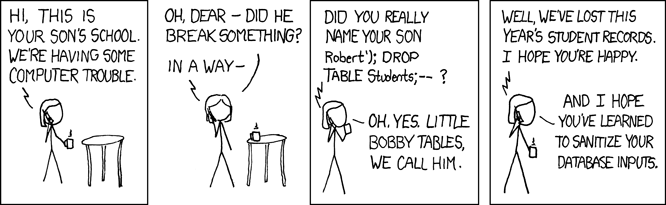

---
aliases:
  - A1 Protokoll Einführung Webentwicklung
cssclasses: 
tags:
  - 3aAPC/ITL12
date: 2024-11-14
deadline: 2024-11-21
setToDo: true
hide: false
link:
  - https://www.eduvidual.at/mod/assign/view.php?id=6816057
---
# `=dv this.aliases` 
## Metadaten
- Autor: Ingo Schlapschy
- Schuljahr: 2024/25
- Lehrgang: 2
- Klasse: 3aAPC
- Gruppe: C
- Fach: ITL12
- Datum: `=dv this.date`
### Angabe
```markdown
- Kommunikationsablauf – Webserver und Client/Browser
- Installation Entwicklungsumgebung (Webserver+PHP+MySQL/MariaDB - oder Alternative und ein Editor mit PHP Support)
- Sicherheitsrisiken von Webanwendungen (Phishing, Datendiebstahl, SQL Injections, Cross-Site-Scripting, Session-Hijacking, DoS, ...)
- Maßnahmen zum Schutz von Webanwendungen (Verschlüsselung, Multifaktor Authentifizierung, Sanitizing/Prepared Statements,...)
```
### ToDo
- [x] Kommunikationsablauf erklären Webserver - Client(Browser) ✅ 2024-11-14
- [x] Entwicklungsumgebung aufsetzen ✅ 2024-11-14
	- [x] XAMPP installieren ✅ 2024-11-14
	- [x] Netbeans installieren ✅ 2024-11-14
- [x] Überblick Sicherheitsrisiken Webandwendungen ✅ 2024-11-14
- [x] Überblick Schutzmaßnahmen ✅ 2024-11-14
## Kommunikation Webserver - Client
> [!NOTE]+ https://www.eduvidual.at/course/section.php?id=3377590
> 
> - PHP ist ein Akronym für „PHP: Hypertext Preprocessor“
> - PHP ist eine weit verbreitete Open-Source-Skriptsprache
> - PHP-Skripte werden auf dem Server ausgeführt

### HTTP (Hyper Text Transfer Protocol)
- Die Kommuniktion zwischen Client und Webserver verläuft (normalerweise) über HTTP
- HTTP ist ein Layer 7 (Application) Protocol
- Basiskonzepte
	- HTTP is simple
	- HTTP is extensible
	- HTTP is stateless, but not sessionless
		- der Status kann in cookies festgehalten werden
- HTTP kümmert sich nicht um die Verbindung
	- ... das ist Layer 4 (Transport)
#### Client
- Software auf user-Seite
- z. B. Web-Browser
- Eröffnet **immer** die Kommunikation
#### Webserver
- "serviert" das vom client angefragte Dokument
- erscheint als einzige Maschiene, kann aber aus 
- mehreren zusammenarbeitenden Servern bestehen
#### HTTP Ablauf (Client-Side)
1. TCP connection eröffnen
2. HTTP-message senden
3. Server-Antwort lesen
4. TCP connection weiterverwenden oder schließen
## Entwicklungsumgebung aufsetzen
- XAMPP installieren
- Apache Netbeans installieren

## Sicherheitsrisiken Webandwendungen
### Gefahren
- Phishing
	- "gefälschte" Webseiten die sich als ihre original-pendants ausgeben um den Nutzer zur Eingabe sensibler Daten (passwort) aufzufordern
- Datendiebstahl
	- Das was google, amazon, etc. machen, aber illegal
- SQL Injections
	- eingabe von SQL-Befehlen z. B. über das ausfüllen von Textfeldern
	- [xkcd: Exploits of a Mom](https://xkcd.com/327/)  
- Cross-Site-Scripting (XSS)
	- Code wird auf website eingeschleust
- Session-Hijacking
	- bestehende Verbindung mitlesen/anpassen
	- z.B.: Packet-Sniffing per Wireshark
- DoS (Denial Of Service)
	- Überlastung eines Servers
### Maßnahmen
- Verschlüsselung
	- Gesniffte Packets werden unlesbar
- Multifaktor Authentifizierung
	- Ein geleaktes Passwort (z. B. durch phishing) reicht zum anmelden nicht mehr aus.
- Sanitizing/Prepared Statements
	- Beugt SQL-Injections vor
## Notizen aus dem Unterricht
- 
## Quellen
- [An overview of HTTP - HTTP | MDN](https://developer.mozilla.org/en-US/docs/Web/HTTP/Overview)
- [327: Exploits of a Mom - explain xkcd](https://www.explainxkcd.com/wiki/index.php/327:_Exploits_of_a_Mom)