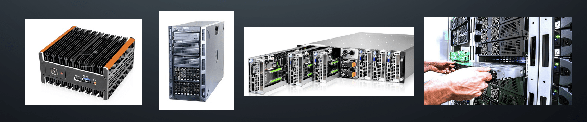
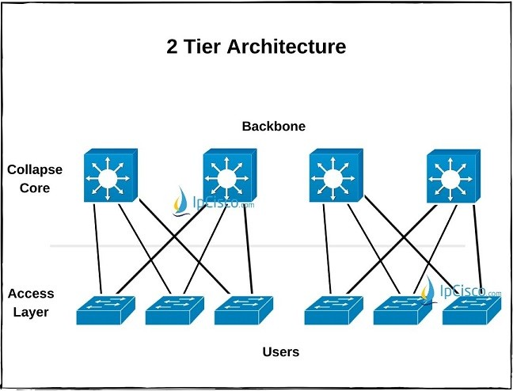
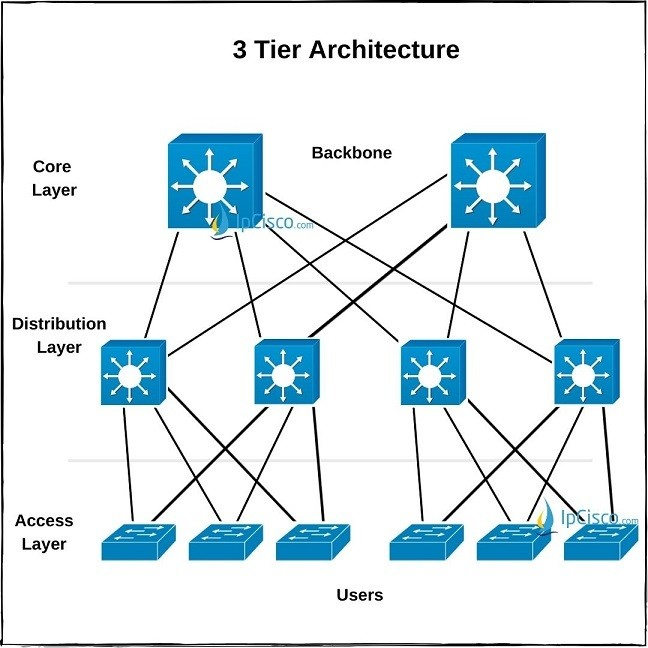
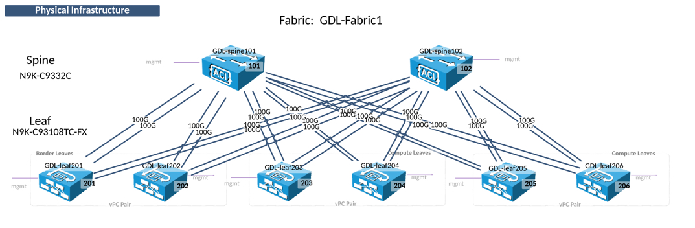
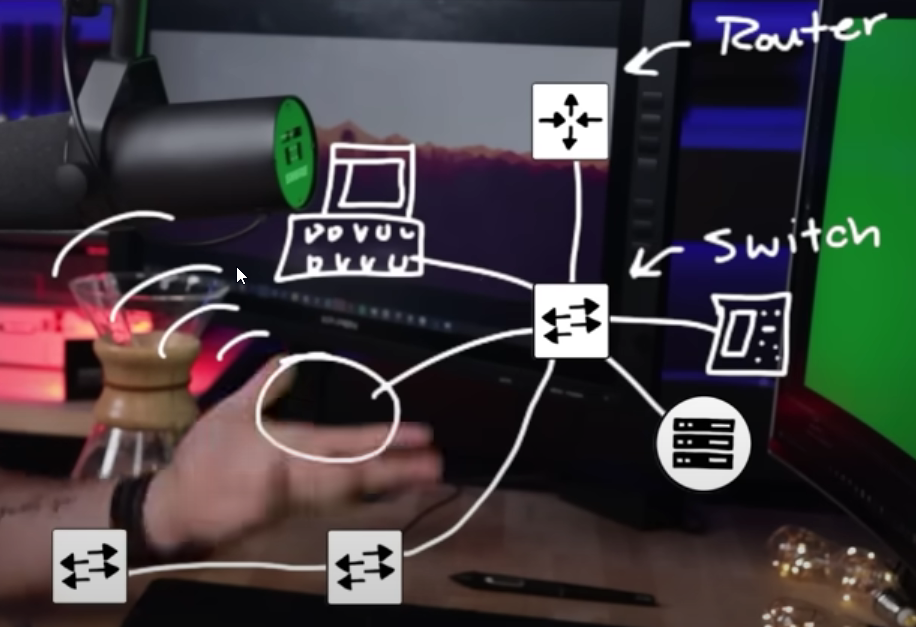
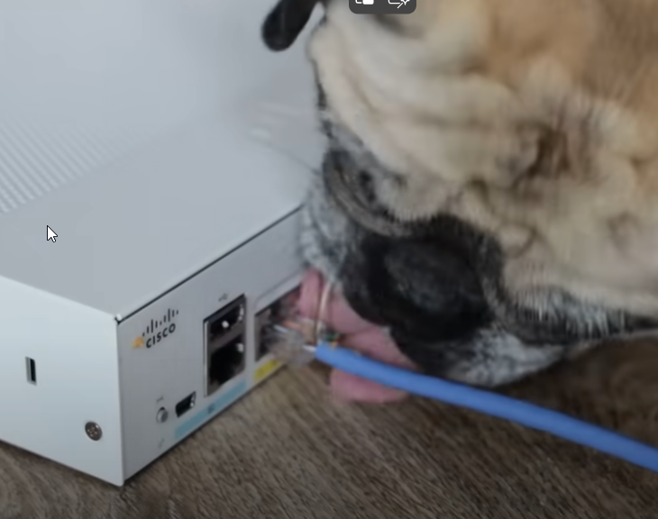

# Servertechnik Grundlagen
---
- Autor: Ingo Schlapschy
- Schuljahr: 2024/25
- Lehrgang: 2
- Klasse: 3aAPC
- Gruppe: C
- Fach: DTSM
- Datum: 2024-11-15
---
Inhaltsverzeichnis

- [Angabe](#angabe)
	- [ToDo](#todo)
- [Lösung](#l%C3%B6sung)
	- [Über Serverhardware](#%C3%9Cber-serverhardware)
	- [Anwendungsfälle Server](#anwendungsf%C3%A4lle-server)
	- [Bauformen](#bauformen)
		- [Mini-Server](#mini-server)
		- [Tower-Server](#tower-server)
		- [Rack-Server](#rack-server)
		- [Blade-Server](#blade-server)
	- [USV (Unterbrechungsfreie Stromversorgung)](#usv-unterbrechungsfreie-stromversorgung)
	- [Redundanz](#redundanz)
		- [Arten Beabsichtigter Redundanz](#arten-beabsichtigter-redundanz)
		- [Verkabelungs-Tipps](#verkabelungs-tipps)
- [Quellen](#quellen)
## Angabe

> [!Angabe] Original
> - Besondere Eigenschafen von Serverhardware nennen
> - 4 verschiedene Bauformen für Server erkennen und beschreiben können  
> - redundante Hardware begründen
> - Einsatzbereiche von Servern definieren
> - Schutzkonzepte für Serverhardware nennen - Verkabelung im Serverbereich
### ToDo
- [x] Eigenschaften Serverhardware
- [x] 4 Serverbauformen beschreiben
- [x] begründung: warum retundant auslegen
- [x] Server Einsatzbereiche
- [x] Schutzkonzepte Serverhardware
	- [x] Verkabelung
## Lösung
### Über Serverhardware
- An und für sich entscheidet nicht die Hardware ob es sich um einen Server oder Client handelt, sondern die Software.
- Je nach Situation macht es aber Sinn dezidierte Serverhardware zu verwenden
- Diese ist für den Anwendungsfall meist:
	- spezifischer
		- Nötige Komponenten in besserer Qualität
			- z. B. Speicher, Prozessor, etc.
		- Unnötige Komponenten entfallen
			- z.B. Grafikkarte, WLAN, etc.
	- robuster
		- für Dauerbetrieb geeignet
	- besser integrierbar/austauschbar
		- Anschlüsse
		- Bauform
### Anwendungsfälle Server
- Application Server
	- Hosten Web-Apps
	- Auch innerhalb eines LAN möglich (nicht unbedingt WAN/Internet)
- Catalog Server
	- Index für große, verteilte Netzwerke
- Communication Server
	- Stellen Kommunikationsumgebung zur Verfügung
- Computing Server
	- Führt aufwendige Berechnungen aus
	- hat (hoffentlich) leistungsstarke Hardware
- Database Server
	- Hostet DBMS (z.B. MariaDB)
	- Hostet Datenbank
- Fax/Print Server
	- Teilt Fax/Drucker mit Netzwerk
- File Server
	- Teilt Dateien und Verzeichnisse in Neztwerk
	- z.B. NAS
- Game Server
	- Ermöglicht div. Multiplayer-Optionen
- Mail Server
	- Ermöglichen E-Mail kommunikation
- Proxy Server
	- Knotenpunkt zwischen eigentlichem Server u. Client
	- Steuert/Filtert den Traffic
	- kann Traffic-performance verbessern
	- kann Sicherheit verbessern
### Bauformen
- [Bilder v.l.n.r.: Mini, Tower, Blade, Rack](https://www.eduvidual.at/pluginfile.php/7764773/course/section/3377718/Bildschirmfoto%202023-02-09%20um%2015.27.54.png) 
	- 
#### Mini-Server
- Kleines, kompaktes Gerät für überschaubare Server-Anforderungen
- Kleines Gerät das 
	- ein/wenige kleinere Sevices ausführt
- z. B. als Home-Server
- Vorteile
	- Kompakt
	- Günstig
- Nachteile
	- Wenig Leistung
		- Insgesamt
		- Für Volumen
		- Für Energiebedarf
		- Für Kosten
	- Schlecht Skalierbar
	- Kaum konfigurierbar
#### Tower-Server
- Sieht aus wie ein "klassischer Computer"
- Verwendung als leistungsstarkes Gerät das 
	- ein großes Service oder
	- mehrere mittlere/kleinere Services ausführt
- Vorteile
	- Sehr Individuelle Lösungen möglich
	- Vergleichsweise Günstig in Anschaffung
- Nachteile
	- Upgrade Teuer
	- Wenig Leistung
		- Für Volumen
		- Für Kosten
#### Rack-Server
- "klassischer Server"
- Rack... Gerüst/Gehäuse für 
	- (mehrere) Rack-Server
- Rack-Server... Server der in ein Rack passt
- Auf Dimensionierung achten
- Verwendung wenn
	- mehrere Server benötigt werden
	- Spezialisierte Server benötigt werden
- Vorteile:
	- Gute Skalierbarkeit
	- Effizient
	- Platzsparend
- Nachteile:
	- teils schwierig zu kühlen
	- Hohe Investitionskosten
#### Blade-Server
- Modulares Gehäuse für Server Blades
	- meist (wie [Rack-Server](#Rack-Server)) in ein Rack eingebaut
- Server Blade... der eigentliche Server
- Vorteile/Nachteile:
	- Wie Rack-Server aber noch...
		- spezialisierter
		- effizienter
		- teurer
### USV (Unterbrechungsfreie Stromversorgung)
- Sichert die gewünschte Stromversorgung 
- Mögliche Probleme
	- Stromausfall
	- Unterspannung
	- Überspannung
	- Frequenzabweichung
	- Oberschwingungen
- Umsetzung
	- Meist mittels Batterie/Akku
	- Ermöglicht sicheres herunterfahren ohne Datenverluste
	- Manchmal auch für weiteren Betrieb für begrenzten Zeitraum (Kritische Systeme)
### Redundanz
- Unbeabsichtigte Redundanz
	- Etwas doppelt machen, obwohl 1x reichen würde/besser wäre
	- z. B. nicht normalisierte Datenbank
- Beabsichtigte Redundanz
	- Man sorgt für Ausfallssicherheit
	- z. B. Sicherheitskopie einer Datenbank
- Single Point of Failure (SPoF)
	- Ein versagen an diesem Punkt bringt das ganze System zum versagen
	- Sollte man vermeiden
#### Arten Beabsichtigter Redundanz
- Funktionelle Redundanz
	- Mehrfache Auslegung von Komponenten in Anlage
- Georedundanz
	- Mehrfache Auslegung über verschiedene Orte
- Datenredundanz
	- Sicherungskopien
	- Gespiegelte/Parallele Daten (Raid 1, Raid 5)
#### Verkabelungs-Tipps
- Immer redundante Verbindungen zwischen den Switches/Routern haben
	- [Network-Design-Advice-Video](https://www.youtube.com/watch?v=wwwAXlE4OtU&list=PLHSwC730k8Km1iUrlXvm7zrKOR8_NsDNn&index=7)
	- good design
		- 2 tier network
			- 
		- 3 tier network
			- 
		- spine leaf network
			- 
	- bad design
		- 
- Single Point of Failure Gefahrenquelle
	- 

## Quellen
- [What is a Server? - GeeksforGeeks](https://www.geeksforgeeks.org/what-is-server/)
- [Blade Servers vs Rack Servers vs Tower Servers | ServerWatch](https://www.serverwatch.com/hardware/blade-servers-vs-rack-servers/)
- [Unterbrechungsfreie Stromversorgung – Wikipedia](https://de.wikipedia.org/wiki/Unterbrechungsfreie_Stromversorgung)
- [Redundanz | Die Bedeutung von Redundanz in der Informatik - IONOS](https://www.ionos.de/digitalguide/server/sicherheit/redundanz/)
- [Network-Design-Advice-Video](https://www.youtube.com/watch?v=wwwAXlE4OtU&list=PLHSwC730k8Km1iUrlXvm7zrKOR8_NsDNn&index=7)