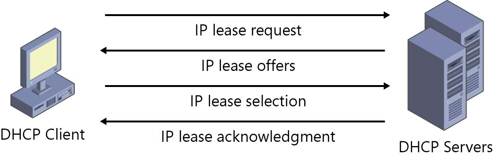

# DHCP Server
---
- Autor: Ingo Schlapschy
- Schuljahr: 2024/25
- Lehrgang: 2
- Klasse: 3aAPC
- Gruppe: C
- Fach: Informatik
- Datum: 2024-11-18
---

## Angabe

> [!Info]
> - Was ist ein DHCP-Server
> - Was macht er?
> - Was hat er für Hardware-Anforderungen

### ToDo
- [ ] Zusammenschreiben
- [ ] Untereinander austauschen
## Lösung

> [!NOTE] Def.: Dynamic Host Configuration Protocol (DHCP)
> Teilt den Clients (MAC-Adressen im Netzwerk) IP-Adressen zu

- Haben eine Range von IP-Adressen die sie den Clients des Netzwerks zuordnen
- Zuordnungsarten
	- statisch
		- manuelle Zuweisung
		- Wichtig für DHCP-Server selbst
	- dynamisch
		- IP-Adr. aus range werden automatisch zugeordnet
		- IP-Adressen werden (nach gewisser Zeit) zusätzlich wieder freigegeben
	- automatisch
		- IP-Adr. aus range werden automatisch zugeordnet
		- Adressen werden NICHT wieder freigegeben
- Wird über UDP (User-Datagram Protcol (Transport-Layer (L4))) übermittelt
- Hardware Anforderungen
	- Generell eher niedrige Anforderungen
		- Netzwerkanschluss
		- Aktuelle Linux Distro
		- z. B. Raspberry Pi OS + DNSMasq
		- Anforderungen steigen für sehr große Netzwerke
- Ablauf Zuordnung neuer IP-Adresse
	- IP-Lease Verfahren !
		- 
	- Client: DHCP Discover
	- Server: DHCP Offer
	- Client: DHCP Request
	- Server: DHCP ACK
	
## Notizen aus dem Unterricht

## Quellen
- 
