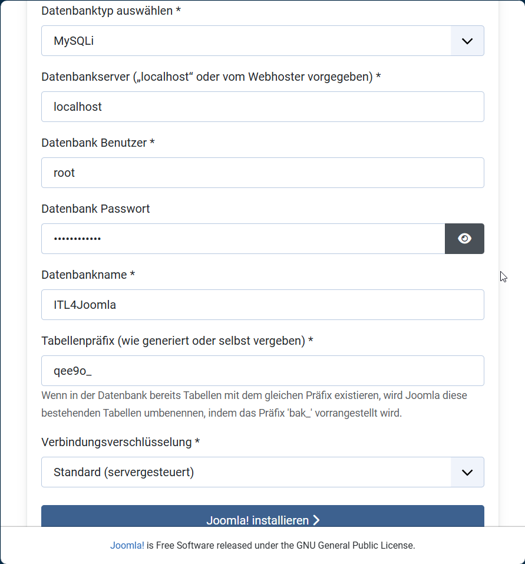

# Joomla Grundlagen
---
- Autor: Ingo Schlapschy
- Schuljahr: 2024/25
- Lehrgang: 2
- Klasse: 3aAPC
- Gruppe: C
- Fach: ITL4
- Datum: 2024-11-20
## Angabe
---
```
1. Lernziele
    • eine Übersicht über Content-Management-Systeme erhalten
    • 3 aktuelle Content-Management-Systeme aufzählen können
    • Komponenten eines CMS aufzählen können
    • CMS Joomla installieren können
2. Aufgabenstellung
	Beschäftigen Sie sich mit den Content Management Systemen, Installieren Sie das CMS Joomla, wählen Sie ein Thema für ihre Website und versuchen Sie die Umsetzung der folgenden Aufgaben:
	1. Installation eines entsprechenden Designs (Templates)
	2. Erstellung von 2 Bereichen bzw. 2 Kategorien laut Thema
	3. Hinterlegen von 5 Artikel inkl. Zuordnung
	4. Erweiterung um zwei Positionen aus folgender Auswahl:
		1. Feedbackformular
		2. Foto-Galerie
		3. Sitemap
		4. Mehrsprachenfähigkeit
		5. Gästebuch
		6. Statistiken
		7. Zufallsbilder 
		8. Navigationspfad
		9. Frontend Font Size Adjuster
Installationsinformationen unter: 
https://docs.joomla.org/J3.x:Installing_Joomla/de bzw.  
https://docs.joomla.org/Portal:Beginners/de
```
---
### ToDo
- [ ] Übersicht CMS
	- [x] Beispiele
	- [ ] Komponenten
- [x] Installation Joomla
- [ ] Website erstellen
	- [x] Thema erstellen
	- [ ] Design Template verwenden
	- [x] 2 Bereiche oder Kategorien
	- [x] 5 Artikel erstellen und zuordnen
	- [x] 2 Positionen hinzufügen
- [x] Abgeben
## Allgemeines zu CMS
> [!NOTE] Def.: Content Management System (CMS)
> Software für (das gemeinschaftliche) Erstellen/Verwalten/Bereitstellen von Inhalten für (meistens) eine Website.
### Beispiele CMS
- Joomla
- Wordpress
- Typo3
- Drupal
- Wix.com
- Shopify
### CMS Komponenten
#ToDo/Ask 
## Joomla installieren
- Vorraussetzungen
	- [Joomla! installieren – Joomla! Documentation](https://docs.joomla.org/J3.x:Installing_Joomla/de)
	- `xampp\php\php.ini` empfohlene Einstellungen überprüfen/anpassen
		- memory_limit - **Minimum:** 64M **Empfohlen:** 128M oder besser
		- upload_max_filesize - **Minimum:** 30M
		- post_max_size - **Minimum:** 30M
		- max_execution_time - **Empfohlen:** 30
- [Joomla! Installationsdateien](https://downloads.joomla.org/de/latest) runterladen
	- Entpacken (in eigenen Unterordner) nach `xampp\htdocs` 
		- image 
- [Datenbank für Joomla! erstellen](https://docs.joomla.org/Creating_a_Database_for_Joomla!/de)
	- XAMPP starten
		- Apache starten
		- MySQL starten
	- Neue Datenbank `ITL4Joomla` mit PHPMyAdmin erstellen
- Installation in Browser starten
- `http://localhost/Joomla/installation/index.php`
	- 
	- 
## Joomla konfigurieren
- Backend: `http://localhost/Joomla/administrator`
### Menüpunkte
- Coffee Gear
	- Brewer
	- Grinder
- About Ingos Coffee Blog
- Roasters
- Home

Featured Articles auf Homepage

Feed für Site-Updates

Kaffee-Equipment

### Artikel
- Paul und Bohne
- Hario Switch
- 1zPresso K-Ultra
- Outin Nano
- Introduction

## Erweiterungen
### Gästebuch


## Fehlermeldung -> Shutdown MariaDB
beim Versuch eine Galerie einzubauen plötzlich folgende Fehlermeldung


mySQL wird automatisch beendet.
Neustart behebt das Problem nicht
Blick in die Logs -> Problem mit Plugin "Aria" (was auch immer das sein mag)


Online-Problemlösungs-Anleitung durchführen nicht möglich

-> Deswegen Abbruch des Projekts und XAMPP neu installieren
## Notizen aus dem Unterricht

## Quellen
- [Content-Management-System – Wikipedia](https://de.wikipedia.org/wiki/Content-Management-System)
- 
