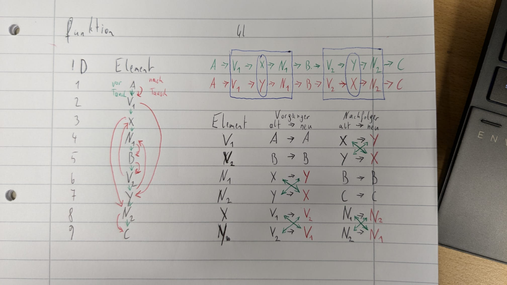
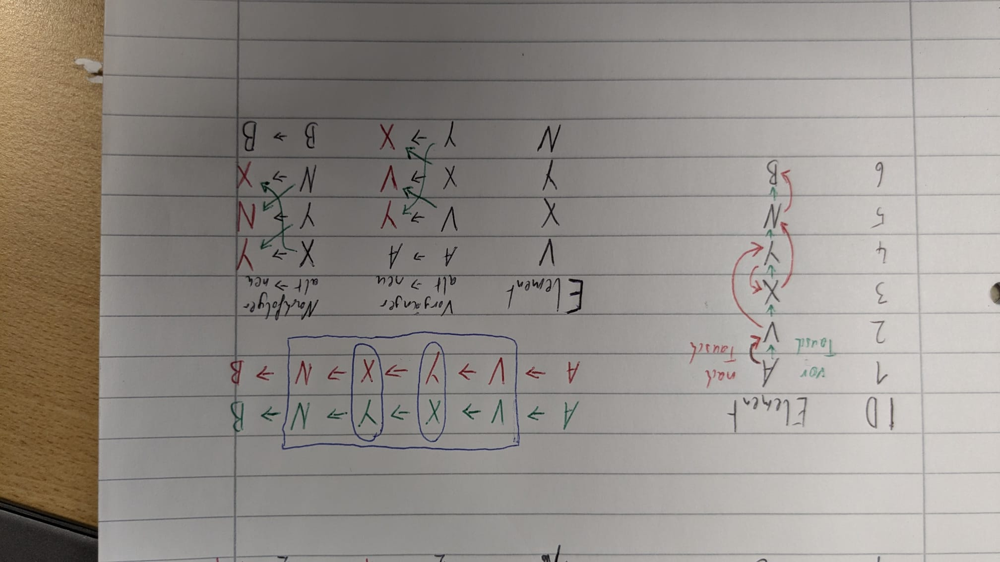

# Listen
---
- Autor: Ingo Schlapschy
- Schuljahr: 2024/25
- Lehrgang: 2
- Klasse: 3aAPC
- Gruppe: C
- Fach: Informatik
- Datum: 2024-11-20
---
### ToDo
- [x] Tausch zweier Elemente in doppelt verketteter Liste
	- [x] allgemein
	- [x] nebeneinander
- [ ] Abgeben
## Lösung
### Lineare Listen
> [!NOTE] Def.: Lineare Listen
> Eine verkettete Liste ist eine dynamische Datenstruktur, in der Datenelemente geordnet gespeichert sind. Bei ihrer Erstellung braucht die maximale Anzahl der Elemente nicht festgelegt zu werden, und die Anzahl darf während der Laufzeit beliebig variieren.
#### Arten von Linearen Listen

##### Einfach verkettet
- Nachfolger ist Hinterlegt
- `A->B->C`
##### Doppelt verkettet
- Nachfolger UND Vorgänger sind hinterlegt
- `A->B->C` UND
- `A<-B<-C`
##### Mehrfach verkettet
- Elemente haben mehrere Felder nach denen sie sortiert werden können
	- z. B. ID, Bezeichnung, Datum, Betrag, etc.
##### Kreisverkettung
- Letztes Element verlinkt auf erstes Element
- `A->B->C->A->B...`
##### Doppelte Kreisverkettung
- Wie Kreisverkettung aber auch der Vorgänger ist hinterlegt
### Fall: Allgemein
Vertauschen der (nicht nebeneinander liegenden) Elemente X und Y
ZN... Zeiger Nachfolger
ZV... Zeiger Vorgänger
t0... Vor Tausch
	...->V1->X->N1->...->V2->Y->N2->...
t1... Nach Tausch
	...->V1->Y->N1->...->V2->X->N2->...

| ID    | Element | t0: ZN | t1: ZN | Änderung Nachfolger | t0: ZV | t1: ZV | Änderung Vorgänger |
| ----- | ------- | ------ | ------ | ------------------- | ------ | ------ | ------------------ |
| 1     | A       | 2      | 2      |                     | 0      | 0      |                    |
| 2     | V1      | 3      | ==7==  | V1: X->Y            | 1      | 1      |                    |
| ==3== | ==X==   | 4      | ==8==  | X: N1->N2           | 2      | ==5==  | X: V1->V2          |
| 4     | N1      | 5      | 5      |                     | 3      | ==7==  | N1: X->Y           |
| 5     | B       | 6      | 6      |                     | 4      | 4      |                    |
| 6     | V2      | 7      | ==3==  | V2: Y->X            | 5      | 5      |                    |
| ==7== | ==Y==   | 8      | ==4==  | Y: N2->N1           | 6      | ==2==  | Y: V2->V1          |
| 8     | N2      | 9      | 9      |                     | 7      | ==3==  | N2: Y->X           |
| 9     | C       | 0      | 0      |                     | 8      | 8      |                    |
#### Vorgang Allgemein
1. Die Nachfolger anpassen
	1. Nachfolger von V1: X->Y
	2. Nachfolger von Y: N2 -> N1
	3. Nachfolger von V2: Y->X
	4. Nachfolger von X: N1 -> N2
	- d.h.: V1<-Y<-N1<-...<-V2<-X<-N2
	- Alternativ:
	- d.h.: V1->Y->N1->...->V2->X->N2
2. Die Vorgänger anpassen
	1. Vorgänger von N2: Y->X
	2. Vorgänger von X: V1->V2
	3. Vorgänger von N1: X->Y
	4. Vorgänger von Y: V2->V1
#### Alternative Beschreibung: Vorgang Allgemein
1. Nachfolger anpassen
	1. Bei den Nachfolgern tauschen als Vorgänger X mit Y
	2. Bei X und Y tauschen als Vorgänger V1 mit V2
2. Vorgänger anpassen
	1. Bei den Vorgängern tauschen als Nachfolger X mit Y
	2. Bei X und Y tauschen als Nachfolger N1 mit N2

### Sonderfall: Nebeneinander
Vertauschen der (nebeneinander liegenden) Elemente X und Y
t0... Vor Tausch
	...->V->X->Y->N->...
t1... Nach Tausch
	...->V->Y->X->N->...

| ID    | Element | t0: ZN | t1: ZN | Änderung Nachfolger | t0: ZV | t1: ZV | Änderung Vorgänger |
| ----- | ------- | ------ | ------ | ------------------- | ------ | ------ | ------------------ |
| 1     | A       | 2      | 2      |                     | 0      | 0      |                    |
| 2     | V       | 3      | ==4==  | V: X->Y             | 1      | 1      |                    |
| ==3== | ==X==   | 4      | ==5==  | X: Y->N             | 2      | ==4==  | X: V->Y            |
| ==4== | ==Y==   | 5      | ==3==  | Y: N-> X            | 3      | ==2==  | Y: X->V            |
| 5     | N       | 6      | 6      |                     | 4      | ==3==  | N: Y->X            |
| 6     | B       | 0      | 0      |                     | 5      | 5      |                    |
#### Vorgang Sonderfall Nebeneinander
1. Die Nachfolger anpassen
	1. Nachfolger vom Vorgänger V: X->Y
	2. Nachfolger von Y: N->X
	3. Nachfolger von X: Y->N
	- d.h.: V->Y->X->N
2. Die Vorgänger anpassen
	1. Vorgänger vom Nachfolger N: Y->X
	2. Vorgänger von X: V->Y
	3. Vorgänger von Y: X->V
	- d.h.: V<-Y<-X<-N
#### Alternative Beschreibung Vorgang Sonderfall Nebeneinander
1. Bei Vorgänger, X und Y
	1. Nachfolger wird 1 vorgerückt
	   (rausfallend wird hinten angereiht)
		Für:           V,X,Y
		vorher:      ==2==,3,4
		nachher:   3,4,==2==
2. Bei X, Y und Nachfolger 
	1. Vorgänger wird 1 nach hinten gerückt
	   (rausfallend wird vorne angereiht)
		Für:           X,Y,N
		vorher:      3,4,==5==
		nachher:   ==5==,3,4

## Notizen aus dem Unterricht
### Beispiel 
#### Einfache Verkettung über Name

| ID  | Name   | Zeiger | Hinweis |
| --- | ------ | ------ | ------- |
| 1   | Fink   | 5      |         |
| 1   | Müller | 3      |         |
| 3   | Schulz | 0      | Ende    |
| 4   | Bauer  | 1      | Start   |
| 5   | Meier  | 2      |         |
#### Weitere Beispiele/Unterlagen
[3ITI_INF_Listen_Einführung](https://www.eduvidual.at/pluginfile.php/7765611/mod_resource/content/4/3ITI_INF_Listen_Einf%C3%BChrung.pdf)
[Microsoft Word - Listenformen.docx](https://www.eduvidual.at/pluginfile.php/7765612/mod_resource/content/2/VerketteteListen%C3%9Cbersicht.pdf)