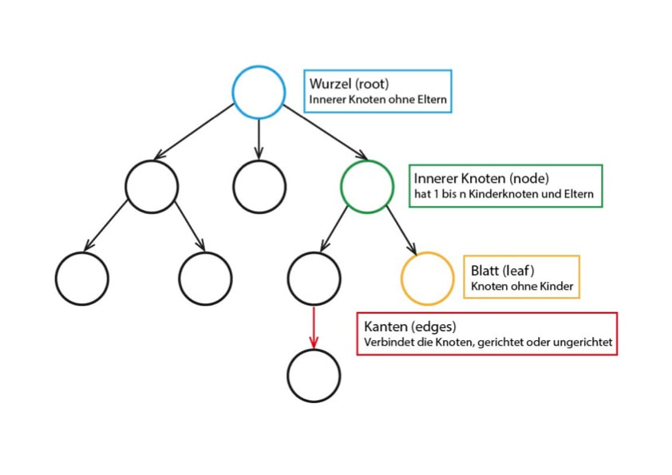
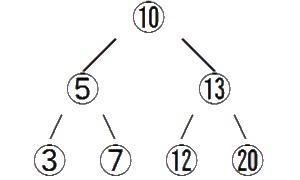
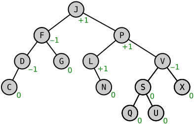
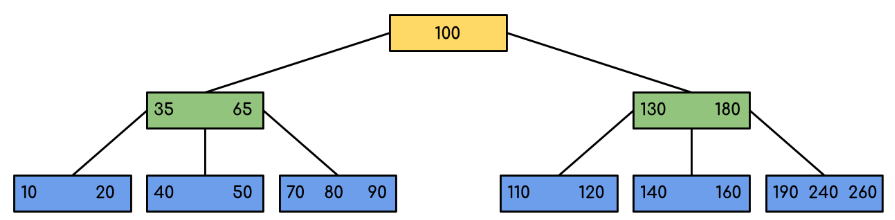
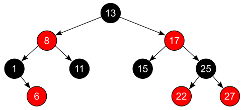

# Datenstruktur Baum
---
- Autor: Ingo Schlapschy
- Schuljahr: 2024/25
- Lehrgang: 2
- Klasse: 3aAPC
- Gruppe: C
- Fach: ITLxx/Informatik
- Datum: 2024-11-21

---
`ToDo: Create Table of Content && Remove this comment`

---
## Angabe

- Erweitern Sie ihre Mitschrift mit aktuellem Kapitel.
- Allgemeine Beschreibung von Bäumen/ Binärbäume (Wurzel, Knoten, Blätter, Level, Kinder, Brüder, Halbblatt).
- Binärbäume: Einfügen, Ausgeben (Traversierung) , Löschen
- Ergänzen Sie ihre Mitschrift noch mit folgenden Beispielen:
    
    - Datenstruktur Binärbaum - Übungsbeispiele
        - 19 1 26 11 21 43 38 55 58 => Wurzel 19
        - 5 10 15 3 55 31 22 14 13 7 9 => Wurzel 5
        - 24 10 9 8 17 50 47 90 48 2 => Wurzel 24
    
    - Datenstruktur Baum - Traversierungsbeispiele Ue1 + Ue2
    
    - Datenstruktur Baum - Löschen
---
### ToDo
- [ ] ...
- [ ] Abgeben
## Lösung
### Definition

> [!NOTE] Def.: Baum
> - Dynamische Datenstruktur
> - Hierarchisch aufgebaut
> - Besteht aus Knoten und Kanten
> - Jedes Element hat genau 1 Vorgänger
> - Jedes Element kann 0-n Nachfolger haben
> - Es gibt genau 1 Wurzelelement

#### Knoten (node)
- Beinhalten Informationen
- Arten von Knoten
	- Wurzel (root)
		- Oberstes Element eines Baumes
		- Hat keinen Vorgänger
		- Existiert genau 1x
	- Teilknoten (node)
		- Zwischenelement
		- Hat Genau einen Vorgänger 
		- Hat 1-n Nachfolger
	- Blatt (leaf)
		- Hat keine Nachfolger
#### Kanten (edge)
- Verbindung zwischen den Knoten
- Veranschaulicht Hierarchie

#### Weitere Begriffe
- Level
	- root -> Level 0
	- Kinder von root -> Level 1
	- Kinder von Kinder von root -> Level 2
- Kinder
	- Knoten
	- Liegt in Hierarchie unter ihrem Parent
- Parent
	- Knoten
	- Liegt in Hierarchie über seinen Kindern
- Brüder
	- Knoten
	- #ToDo/Ask selber Parent oder bloß selber level?
- Halbblatt
	- Im Fall dass _alle_ Knoten Information tragen und externe Blätter nicht vorkommen gibt es (nur) für Binärbäume die Bezeichnung Halbblätter, wenn ein Blatt genau 1 Kind hat.
- Dynamische Datenstruktur
	- Anzahl der Elemente nicht von vornhinein begrenzt
- Degenerierter Baum
	- nicht balanciert
	- z. B.: Baum ähnelt eher einer Liste als einem Baum
- Balancierter Baum
	- Anzahl der Folgeknoten ist gleichmäßig aufgeteilt
	- z. B.: AVL-Baum
### Traversierung
Abbildung eines Baumes durch eine Liste

#### Level-Order
- Level für Level auslesen
- 10, 5, 13, 3, 7, 12, 20
#### In-Order
- Start: Ganz Links, möglichst weit Unten
- Linkes -> Parent -> Rechts
- 3, 5, 7, 10, 12, 13, 20
#### Pre-Order
- Start: Wurzel
- Wurzel -> Links -> Rechts
- 10, 5, 3, 7, 13, 12, 20
#### Post-Order
- Start: Linkstes, Unterstes Element
- Links -> Rechts -> Wurzel
- 3, 7, 5, 12, 20, 13, 10
- In Praxis selten verwendet
## Besondere Bäume
### Geordneter Baum
- Folgeelemente eines Knotens sind geordnet
- Wird über eine Regel definiert
### Binärbaum
- Jeder Knoten hat max. 2 Nachfolger
### Geordneter Binärbaum
- Jeder innere Knoten hat zumindest ein linkes Kind.
- Linker Nachfolger: Tiefere Ebene
- Rechter Nachfolger: Selbe Ebene
### AVL Baum
Beispiele Rotationen: [DSA AVL Trees](https://www.w3schools.com/dsa/dsa_data_avltrees.php)

>P hat einen Balancefaktor (BF) von +1 weil:
>Max. Anzahl Folgeknoten rechts (KR) = 3 (U,S,Q)
>Max. Anzahl Folgeknoten links (KL) = 2 (L,N)
>-> BF = KR - KL = 3 - 2 = +1
>Da das AVL-Kriterium |$\text{BF}|\le1$ erfüllt ist, ist  keine Rotation nötig (zumindest wegen dieses Knotens)

- Ist ein Binärbaums
- Ist ein geordneter Baum
- Ist höhenbalanciert
	- BF... Balancefaktor 
		- AVL Kriterium: |$\text{BF}|\le1$
		- BF = KR - KL
			- KR... Anzahl max. Folgeknoten rechts
			- KL... Anzahl max. Folgeknoten links
			
- Ziel: Höhe im Gleichgewicht halten (höhenbalanciert)
- Bildungsmethode 1:
	1. Liste Sortieren
	2. Mittlerer Wert als Knoten einfügen (ähnl. Binärsuche)
- Bildungsmethode 2:
	1. Problematischen Bereich feststellen
	2. entsprechende Rotation anwenden
	3. Bei Bedarf wiederholen

| Rotation     | BF Parent (P) | BF Left Child (LC) | BF Right Child (RC) | Anleitung                              |
| ------------ | ------------- | ------------------ | ------------------- | -------------------------------------- |
| Rechts       | -2 (LH)       | -1 (LH)            |                     | P Rechts rotieren                      |
| Links-Rechts | -2 (LH)       | +1 (RH)            |                     | LC Links rotieren P Rechts rotieren |
| Links        | +2 (RH)       |                    | +1 (RH)             | P Links rotieren                       |
| Rechts-Links | +2 (RH)       |                    | -1 (LH)             | RC Rechts rotieren P Links rotieren |

- BF > 0 -> RH... right heavy
- BF < 0 -> LH... left heavy
- $|BF| \le 1$... keine Anpassung nötig
- $|BF| > 1$... Anpassung nötig (Rotation)
### B-Tree

- KEIN Binärbaum
- Verallgemeinerung eines AVL-Baumes (ohne Beschränkung auf Binär-Struktur)
- Knoten bestehen aus Blöcken die mehrere Elemente beinhalten
- Wachsen von Blättern zur Wurzel
- Flachere Bäume -> sind oft schneller
	- weniger Abrufoperationen (sind meist der Flaschenhals) bei Suche
	- dafür mehr Vergleichsoperationen (sind trotzdem vergleichsweise schnell)

### Red-Black-Tree

- schneller zugriff
- Binärer Suchbaum
- ausgeglichen
- hat 2 Forderungen
	- Kindknoten eines roten Knoten ist schwarz
	- Der Pfade des selben Knotens zu jedem seiner "Pfadenden" hat die selbe Anzahl schwarzer Knoten
- aus den 2 Forderungen folgt weiters
	- Halbblätter müssen schwarz sein
	- Die Kinder von Halbblättern müssen rot sein
- Binärer Suchbaum mit kleinster Höhe
- Knoten hat zusätzliches Attribut
### 234-Tree
- ist ein Sonderfall eines [B-Tree](#B-Tree) 
- Hat Ordnung 4 (2-4 Elemente pro Knoten)
- Lässt sich leicht aus [Red-Black-Tree](#Red-Black-Tree) erstellen indem der schwarze parent mit seinen beiden roten Kindern links und rechts gemeinsam einen Block bildet.
