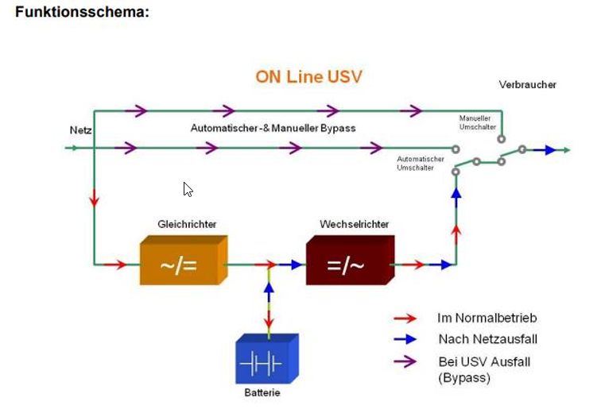
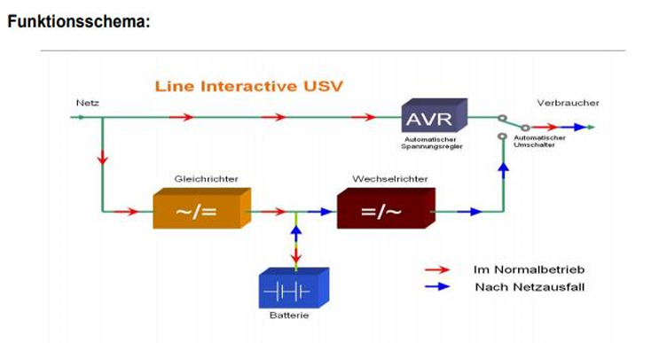
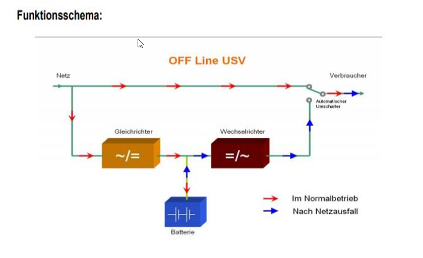
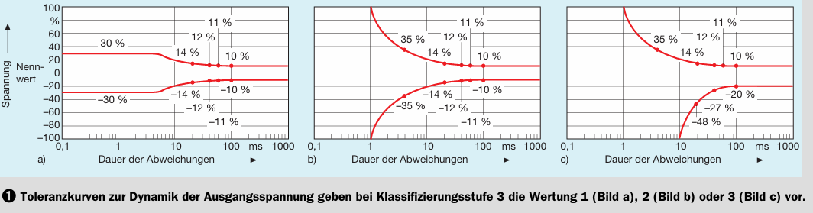
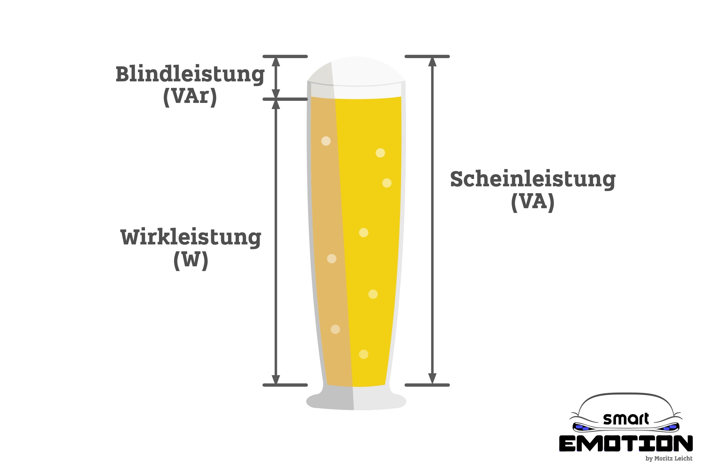

# Unterbrechungsfreie StromVersorgung (USV)
---
- Autor: Ingo Schlapschy
- Schuljahr: 2024/25
- Lehrgang: 2
- Klasse: 3aAPC
- Gruppe:
- Fach: DTSM
- Datum: 2024-11-22
---
## Angabe
---
- Nutzen von USV Anlagen beschreiben können
- die Grundfunktion/Arbeitsweise einer USV wiedergeben können
- die Klassifizierung einer USV anhand der 3 Stufen wiedergeben können
- 3 Typen von USV Anlagen laut Stufe 1 prinzipiell sowie anhand  Schaltbild erklären können
- Aussagen zu Stufe 2 - Klirrfaktor der Ausgangspannung wiedergeben können
- Aussagen zu Stufe 3 - Unterbrechung beim Umschalten - wiedergeben können
- grundlegende Bauteile einer USV (in Form eines Blockschaltbilds) nennen und erklären können
~~- eine einfache Erklärung für die Entstehung von Scheinleistung wiedergeben können~~
---
### ToDo
- [ ] Alle Punkte
- [ ] Abgeben
## Allgemeines

> [!NOTE] Def.: Unterbrechungsfreie Stromversorgung (USV)
> 
> Eine unterbrechungsfreie Stromversorgung (USV) stellt die Versorgung kritischer elektrischer Lasten bei Störungen im Stromnetz sicher.

- Sichert die gewünschte Stromversorgung
	- Netzstörungen: Stromausfall, Spannungsschwankungen, etc.
- Unterbrechungsfrei heißt: (Fast) Keine Unterbrechung der Stromversorgung
	- Auch nicht bei Umschaltung
	- Im Unterschied dazu: Ersatzstromversorgung (z. B. Dieselgenerator)
- Umsetzung meist mittels Batterie/Akku
- USV Ermöglicht:
	- Sicheres herunterfahren ohne Datenverluste
	- Umschalten auf Ersatzstromversorgung
## Nutzen von USV-Anlagen
- Sichert Stromversorgung
- Beugt Vor:
	- Systemcrash
	- Datenverlust
	- Betriebsstillstand
	- Produktionsausfall
	- Hardwareschäden
- Mögliche Probleme in Stromversorgung
	- Stromausfall
	- Unterspannung
	- Überspannung
	- Frequenzabweichung
	- Oberschwingungen
- Ermöglicht
	- Sicheres Herunterfahren
	- Aktivieren einer Ersatzstromanlage (z.B. Diesel-Generator)
### Arten von Netzstörungen
[USV Grundlagen – Thomas-Krenn-Wiki](https://www.thomas-krenn.com/de/wiki/USV_Grundlagen) (nicht im detail abgefragt)

| Störungstyp                                     | Dauer der Störung | Definition                                                                                                                                                                            |
| ----------------------------------------------- | ----------------- | ------------------------------------------------------------------------------------------------------------------------------------------------------------------------------------- |
| Netzausfälle - Power Failure                    | mehr als 10 ms    | Ein Netzausfall wird als Nullspannungsbedingung definiert, dies kann auf ein Netzspannungsfehler zurückführen.                                                                        |
| Spannungsschwankungen - Power Sag               | weniger als 16 ms | Spannungsschwankungen sind Einbrüche, die kurzzeitig unter dem Normalwert liegen. Sie können beim Einschalten großer Anlagen oder Starkstromleitungen auftreten.                      |
| Spannungsspitzen - Switching Transient          | 4 ms bis 16 ms    | Sie werden häufig durch eine statische Entladung verursacht. Spannungsspitzen werden auch oft als Schaltspitzen bezeichnet.                                                           |
| Spannungsstöße - Power Surge                    | weniger als 4 ms  | Diese treten bei plötzlichen und kurzzeitigen Spannungsspitzen auf. Normalerweise kann dies auf einen Blitzeinschlag in der näheren Umgebung zurück geführt werden.                   |
| Unterspannungen - Under Voltage                 | fortlaufend       | Die Spannung fällt unter den zulässigen Grenzwert (für einige Sekunden oder sogar dauerhaft).                                                                                         |
| Überspannung - Over Voltage                     | fortlaufend       | Wenn zum Beispiel große elektrische Anlagen aktiviert werden, kann der die Spannung auf über 100% steigen, dies wird als Überspannung bezeichnet.                                     |
| Frequenzschwankungen - Frequency Variation      | gelegentlich      | Hierbei weicht die Frequenz von der normalerweise konstanten Netzfrequenz ab.                                                                                                         |
| Spannungsverzerrungen - Line Noise              | periodisch        | Eine Spannungsverzerrung wird auch als eine elektrische Störspannung bezeichnet, dies hat einen negativen Einfluss auf die Schaltungen in elektrischen Systemen.                      |
| Spannungsoberschwingungen - Harmonic Distortion | fortlaufend       | Dabei wird die normale Wellenform der Spannung verzerrt und damit verändert Gründe dafür können zum Beispiel einfache Leuchtstoffröhren sein, die dies in die Netzleitung übertragen. |

## Typen von USVs
Definition über 3 Stufen
Alle 3 Stufen gemeinsam definieren das USV
Hinweis: Frühere Regelung hatte sich nur auf Stufe 1 beschränkt
### Stufe 1: (Haupt-)Klasse
#### Klasse 1: VFI (Voltage Frequency Independent)

- Normalbetrieb
	- Verbraucher hängt an Batterie
	- Spannung bei Verbraucher unabhängig von Netzspannung
	- Frequenz bei Verbraucher unabhängig von Netzfrequenz
- Automatischer Umschalter (falls GR, WR, Akku defekt/Akku leer)
- Manueller Umschalter (bei Arbeiten an USV)
- Höherer Stromverbrauch bei Normalbetrieb (Verluste durch GR, WR)
- Schutz vor 
	- Stromausfall
	- Spannungseinbruch
	- Spannungsstösse
	- Unterspannung
	- Überspannung
	- Frequenzschwankungen
	- Schaltspitzent
	- Harmonische Oberwellen
	- Störspannungen
#### Klasse 2: VI (Voltage Independent)

- Normalbetrieb
	- Verbraucher hängt über Spannungsregler am Netz
	- Spannung unabhängig von Netzspannung
	- Frequenz abhängig von Netzspannung
- USV aufgeteilt:
	- Batterie offline
	- Spannungsregler Online
- In Netzleitung ist ein Spannungsregler integriert
	- Gleicht Spanungsschwankungen aus
- Ansonsten Aufbau wie [Klasse 3: VFD (Voltage Frequency Dependent)](#Klasse%203%20VFD%20(Voltage%20Frequency%20Dependent)), aber
- Schutz vor
	- Stromausfall
	- Spannungseinbruch
	- Spannungsstöße
	- Unterspannung
	- Überspannung

#### Klasse 3: VFD (Voltage Frequency Dependent)

- Normalbetrieb
	- Verbraucher hängt direkt am Netz
	- Spannung abhängig von Netzspannung
	- Frequenz abhängig von Netzfrequenz
- Voltage and Frequency Dependent on mains supply
- Simpelstes System
- Offline USV
- Normalzustand
	- Verbraucher : Netz ... verbunden
	- Verbraucher : Batterie ... getrennt
- Stromausfall
	- Verbraucher 
- Verbraucher hängt normalerweise am Netz
- Bei Störungen (Stromausfall) wird auf Versorgung über die Batterie geschaltet
- Schutz vor
	- Stromausfall
	- Spanungseinbruch
	- Spannungsstöße
### Stufe 2: Form der Spannungskurve
- Toleranzbereich für 
	- Form der Ausgangs-Spanungskurve
	- relativ zu Sinusform
	- mit Grenzbereich: ±8%
		- Max. Abweichung von perfekter Sinuskurve
- 2 Buchstaben
	- 1. Buchstabe: Bei Normalbetrieb
	- 2. Buchstabe: Bei Batteriebetrieb
#### Klirrfaktor
- Maß für Anteil der Abweichung/Verzerrung eines Signals
- Verursacht durch Oberschwingung
- relativ zum (eigentlichen) Signal

| Buchstabe | Bedeutung                                                                                      |
| --------- | ---------------------------------------------------------------------------------------------- |
| Y         | Keine Angabe über Spannungsform (muss nicht mal sinusförmig sein)                             |
| X         | Einhaltung der Grenzwerte bei linearer Belastung                                               |
| S         | Einhaltung der Grenzwerte unabhängig von Belastung|
#### Beispiele:
- XY
	- Keine Angabe bei Normalbetrieb
	- max. 8% Abweichung bei linearer Belastung bei Batteriebetrieb
- YX
	- max. 8% Abweichung bei linearer Belastung bei  Normalbetrieb
	- Keine Angabe bei Batteriebetrieb
- SS
	- max 8% Abweichung, unabhängig von Belastung bei Normalbetrieb
	- max 8% Abweichung, unabhängig von Belastung bei Batteriebetrieb
### Stufe 3: Dynamische Änderungen der Spannung
- Toleranzbereich für Abweichungen der 
	- Ausgangs-Spannungskurve bei 
	- dynamischen Änderungen
	- bzgl.
		- wie lange 
		- wie stark
- 3 Ziffern
	- 1. Ziffer: Bei Wechsel des Netzbetriebs (Netz/Batterie/Bypass/...)
	- 2. Ziffer: Bei Lastsprüngen bei Linearer Last (unabh. von Betriebsart)
	- 3. Ziffer: Bei Lastsprüngen bei Nichtlinearer Last (unabh. von Betriebsart)
#### Auswirkungen eines Schalters auf die Spannung
- Wenn ein Schalter gerade nicht schließt (kurzer moment beim öffnen/schließen)
- Schafft es die Spannung den Wiederstand der Luft zu überkommen
- Es gibt einen "Lichtblitz" Dieser kurzfristige Widerstand hat (wie jeder Wiederstand im Stromkreis) Auswirkungen auf die Spannung
	
[elektropraktiker.de/downloads/download/?file=7635&cid=de89d7f7ae&type=fachartikel&uid=1861](https://www.elektropraktiker.de/downloads/download/?file=7635&cid=de89d7f7ae&type=fachartikel&uid=1861) 

| Wert | Bedeutung                       |
| ---- | ------------------------------- |
| 1    | Keine Unterbrechung zulässig    |
| 2    | Max. Unterbrechungsdauer: 1ms   |
| 3    | Max. Unterbrechungsdauer: 10 ms |
## Scheinleistung/Wirkleistung
- Wirkleistung (W)
- Blindleistung (VA)
	- Tritt auf, wenn Kapazitoren/Induktoren (Kondensatoren/Spulen)
- Scheinleistung (VA)
	- Wirkleistung + Blindleistung
- Leistungsfaktor 0.55-0.9

> [!NOTE] Wenn man's genau nimmt:
> Eigentlich ist der Zusammenhang zwischen 
> Scheinleistung S, Wirkleistung P und Blindleistung P 
> der Folgende: 
> - $S^2=P^2+Q^2$
> d.h.:
> - $S=\sqrt{ P^2+Q^2 }$
> - $P=\sqrt{ S^2-Q^2 }$
> - $Q=\sqrt{ S^2-P^2 }$

| Wert                | Einheit                  | Dimension                |
| ------------------- | ------------------------ | ------------------------ |
| Spannung (U)        | Volt (V)                 | $\frac{kg*m^2}{A*s^3}$   |
| Stromstärke (I)     | Ampere (A)               | $A$                      |
| (Wirk-)Leistung (P) | Watt (W)                 | $\frac{kg*m^2}{s^3}$     |
| Scheinleistung (S)  | Voltampere (VA)          | $\frac{kg*m^2}{s^3}$  |
| Blindleistung (Q)   | Voltampere reaktiv (VAr) | $\frac{kg*m^2}{s^3}$  |

## Berechnung Autonomiezeit
$T_{A}=\frac{N_{Akku}*U_{Akku}*Q_{Akku}}{S_{Gesamt}}$
- $N_{Akku}\dots$ Anzahl Akkus [1]
- $U_{Akku}\dots$ Spannung der Akkus [V]
- $Q_{Akku}\dots$ Kapazität der Akkus [Ah]
- $S_{gesamt}\dots$ Scheinleistung des Gesamtsystems [VA]
- $T_{A}\dots$ Zeit die das System autonom laufen kann [h]
## Sonstiges
### Begriffe
- Oberschwingung
	- Signal überlagernde Schwingung 
	- mit niedrigerer Frequenz als Signal
- Gleichrichter
	- Wandelt: Wechselstrom -> Gleichstrom
- Wechselrichter
	- Wandelt: Gleichstrom -> Wechseltrom
- Stromnetz
	- Funktioniert mit Wechselstrom
	- Hat Frequenz (AT: Soll: 50Hz)
	- Hat Spannung (AT: Soll: 230V)
- Akku/Batterie
	- Funktioniert mit Gleichstrom
	- Hat Spannung (abhängig von Bauart)
- Verbraucher
	- Funktioniert meist mit Wechselstrom
	- z. B. Server
- Spannungsregler
	- Stabilisiert die Spannung
## Notizen aus dem Unterricht

## Quellen
- [Scheinleistung – Wikipedia](https://de.wikipedia.org/wiki/Scheinleistung)
