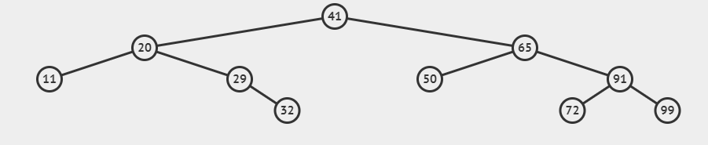

# AVL-Bäume
---
- Autor: Ingo Schlapschy
- Schuljahr: 2024/25
- Lehrgang: 2
- Klasse: 3aAPC
- Gruppe: C
- Fach: ITLxx/Informatik
- Datum: 2024-11-28

---
`ToDo: Create Table of Content && Remove this comment`

---
## Angabe

```
Erstelle eine [Übersicht](https://www.eduvidual.at/mod/page/view.php?id=6816898 "Übersicht") über AVL - Bäumen und ihrer Eigenschaften.

Weiters sollten Erklärungen zu den Balancewerten und Rotationsregeln vorkommen.

Nun erstelle einen AVL-Baum mit folgenden Werten und erkläre die Teilschritte.

**55 -> 24 -> 12 -> 17 ->15 -> 14 -> 35 -> 29 -> 60 -> 16**

Zum Abschluss lösche von folgendem AVL-Baum das Element "50"!

**  
**
```


---
### ToDo
- [ ] Übersicht AVL-Bäume
- [ ] Abgeben
## Lösung
### AVL-Bäume

> [!NOTE] Def.: Begriff
> Ein AVL Baum hat folgende Eigenschaften
> - Baum
> - ist binär
> - ist geordnet
> - Für jeden Knotenpunkt gilt: |BF| <= 1
> 	- D. H.: Der Betrag der Differenz der maximalen Länge der (linken und rechten) Folgeknoten eines jeden Teilbaumes ist <= 1

## Notizen aus dem Unterricht
Unterschied MVC, MVP, MVVM
