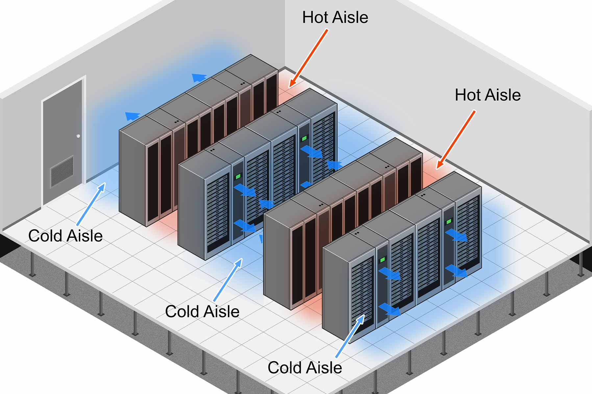
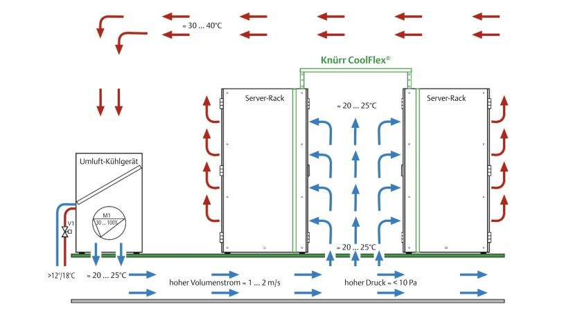

# Serverraum Klimatisierung
---
- Autor: Ingo Schlapschy
- Schuljahr: 2024/25
- Lehrgang: 2
- Klasse: 3aAPC
- Gruppe: C
- Fach: DTSM
- Datum: 2024-12-02

---
`ToDo: Create Table of Content && Remove this comment`

---
## Angabe
- Begründung für ausreichend Klimatisierung nennen
- ein Klimatisierungskonzept näher beschreiben
- zwei mögliche Maßnahmen zur effizienten Nutzung im Rahmen der Klimatisierung nennen

---

## Lösung
### Warum Klimatisierung
#### Temperatur
- Server produzieren viel Abwärme
- Werden sie nicht gekühlt, dann würden sie überhitzen
- Man müsste die Leistung drosseln oder hätte Hardware-Schäden als Folge
#### Luftfeuchtigkeit
- Elektronik und Nässe sind oft keine gute Kombination
- Ist die Luftfeuchtigkeit hoch kann es zu Kondensation kommen
- Optimalwerte 30%-60% (relativ)
- Diese kann Korrosion und Kurzschlüsse verursachen
- Deswegen kann man nicht einfach "lüften"
- Deswegen Kühleranlage 24/7/365
### Server-Klimaanlagen
- Andere Anforderungen als gewöhnliche Klimaanlagen
- Muss für Dauerbetrieb ausgelegt sein
### Konzepte
#### Trennung Warmluft & Kaltluft
- Wenn man verhindert, dass sich warme und kalte Luft vermischen, dann läuft die Kühlung effizienter -> man muss weniger kühlen -> man spart Energie & Kosten ein
- Warmgang/Kaltgang
	- Server sind in Reihen angeordnet.
	- Die Vorderseiten bilden einen Gang, hier wird kalte Luft angesaugt
	- Die Rückseite bilden einen Gang, hier wird warme Luft ausgestoßen
	
- Warmgang/Kaltgang Abkapselung
	- Erweiterung des Warmgang/Kaltgang-Konzepts
	- Die Fronten und Rückseiten sind noch stärker voneinander getrennt. Eine Durchmischung wird noch besser verhindert
	- 
- Doppelboden
	- Warme Luft ist leichter als kalte und steigt somit im Raum auf
	- Man kann unter den Servern einen (an den richtigen Stellen gelochten) doppelten Boden installieren über den die kalte Luft vom Kühlsystem zum Server-Rack transportieren
- Abwärme ableiten
	- z. B. mittels Wärmepumpen die überschüssige Wärme nach außen ableiten
	- "Freie Kühlung"
