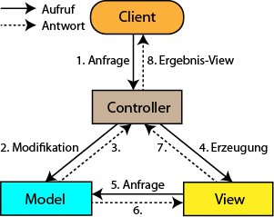

# Model-View-Controller-Konzepte
---
- Autor: Ingo Schlapschy
- Schuljahr: 2024/25
- Lehrgang: 2
- Klasse: 3aAPC
- Gruppe: C
- Fach: Informatik
- Datum: 2024-12-02
---
## Angabe
- Grundaufbau lt. Konzept
- Einsatzmöglichkeiten
- Probleme / nicht behandelte Elemente einer möglichen Software
- andere/ähnliche Konzepte wie MVC (MVVM, MVP)
- Erkläre die Implementierung/Umsetzung des MVC Konzeptes im HUGE [Framework](https://www.eduvidual.at/mod/resource/view.php?id=6816895 "Framework")
---
### ToDo
- [ ] ...
- [ ] Abgeben
## Lösung
### Elemente
#### Model
- Die Daten und die Logik
#### View
- Die UI
#### Controller
- Greift Daten aus dem Model ab und übergibt sie dem View
- Gibt Aktionen die im View gestartet wurden an das Model weiter
### Muster (Patterns)
#### MVC (Model-View-Controller)
- [MVC Design Pattern - GeeksforGeeks](https://www.geeksforgeeks.org/mvc-design-pattern/)
- User interagiert mit View
- View 

### Punkt 1

> [!NOTE] Def.: Begriff
> Definition

## Notizen aus dem Unterricht
Unterschied MVC, MVP, MVVM

## Quellen
- 
- [MVC Design Pattern - GeeksforGeeks](https://www.geeksforgeeks.org/mvc-design-pattern/)
