# Huge Framework 
---
- Autor: Ingo Schlapschy
- Schuljahr: 2024/25
- Lehrgang: 2
- Klasse: 3aAPC
- Gruppe: C
- Fach: ITLxx/Informatik
- Datum: 2024-12-03

---
`ToDo: Create Table of Content && Remove this comment`

---
## Angabe
1. Aufgabenstellung
Installation des Framework
Grundkonfiguration
Login – Test - User: Demo / Passwort: 12345678

Dokumentation:
    • Aus welchen Bausteinen besteht das Framework?
        ◦ Wie sieht die DB aus?
    • Wozu dient der public Ordner?
    • Beschreibe folgende Bausteine:
        ◦ Config
        ◦ Model
        ◦ Controller
        ◦ Core
        ◦ View

2. Fragen
    1. Wie sieht der Konstruktor in PHP Klassen aus?
    2. Wozu dient die „Variable“ $this?
    3. Welche Vorteile hat die Verwendung von OOP in PHP?
    4. Welche Datenkapselungsmethoden gibt es in PHP?
    5. Wie sehen abstrakte Klassen in PHP aus?

---
### ToDo
- [ ] ...
- [ ] Abgeben
## Lösung
### Huge-Framework installieren
#### Composer installieren 
> ist ein Package-/Dependencies Manager
- [Introduction - Composer](https://getcomposer.org/doc/00-intro.md)
	- https://getcomposer.org/Composer-Setup.exe
	-  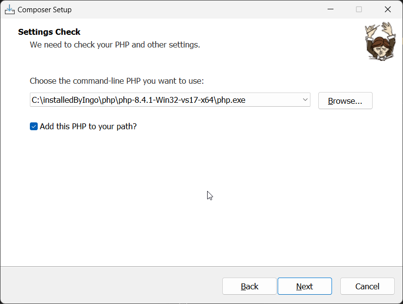
	- 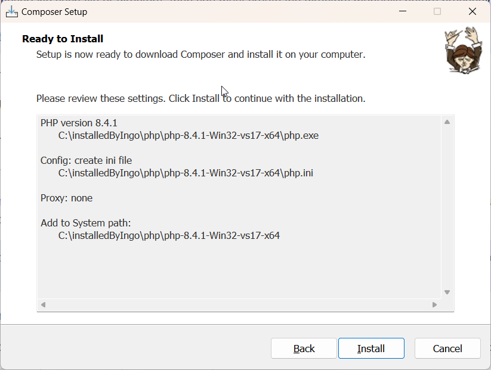
	- 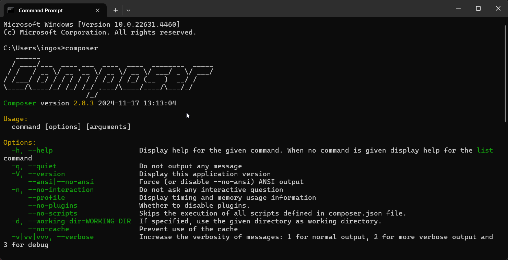
#### Huge installieren
- [Quick guide](https://github.com/panique/huge?tab=readme-ov-file#quick-guide-)
	1. Make sure you have Apache, PHP, MySQL installed. [Tutorial](http://www.dev-metal.com/installsetup-basic-lamp-stack-linux-apache-mysql-php-ubuntu-14-04-lts/).
	2. Clone the repo to a folder on your server
	3. Activate mod_rewrite, route all traffic to application's /public folder. [Tutorial](http://www.dev-metal.com/enable-mod_rewrite-ubuntu-14-04-lts/).
	4. Edit application/config: Set your database credentials
	5. Execute SQL statements from application/_installation to setup database tables
	6. [Install Composer](http://www.dev-metal.com/install-update-composer-windows-7-ubuntu-debian-centos/), run `Composer install` on application's root folder to install dependencies
	7. Make avatar folder (application/public/avatars) writable
	8. For proper email usage: Set SMTP credentials in config file, set EMAIL_USE_SMTP to true
---
- Apache, PHP, MySQL laufen über XAMPP
- huge-repo in Ordner auf server kopieren 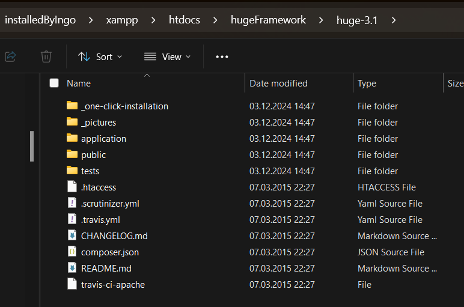
- mod_rewrite überprüfen 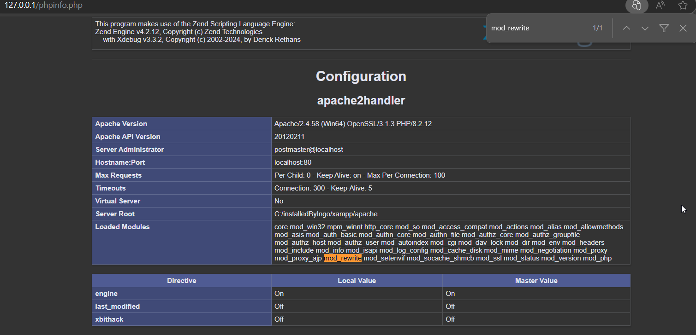
- `appication/config` db-anmeldeinformationen anpassen
	- keine Ahnung was ich diesbezüglich machen soll
- SQL statments aus `application/installation` ausführen um dependencies zu installieren
	- copy&paste 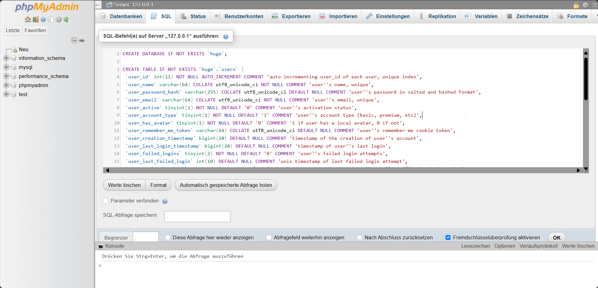
	- Ctrl+Enter 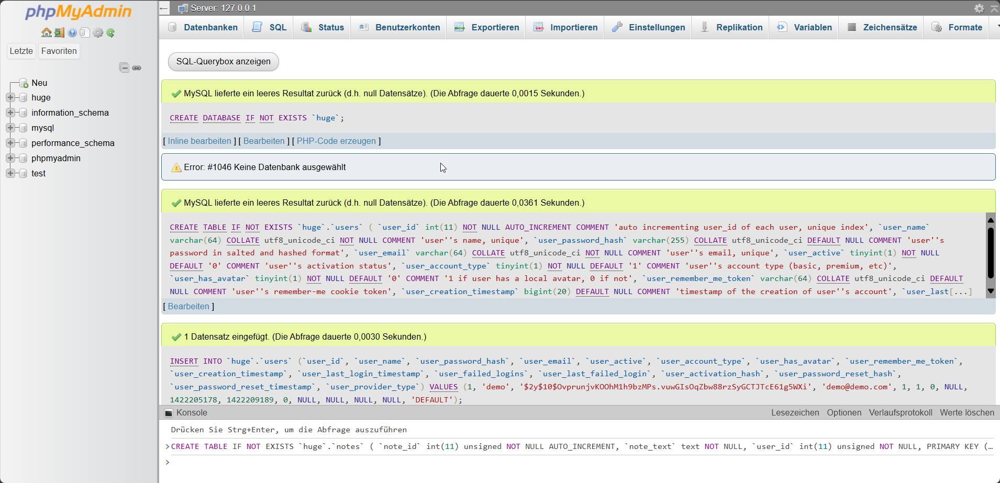
- `Composer install` in `application` ausführen
	- Fehlermeldung 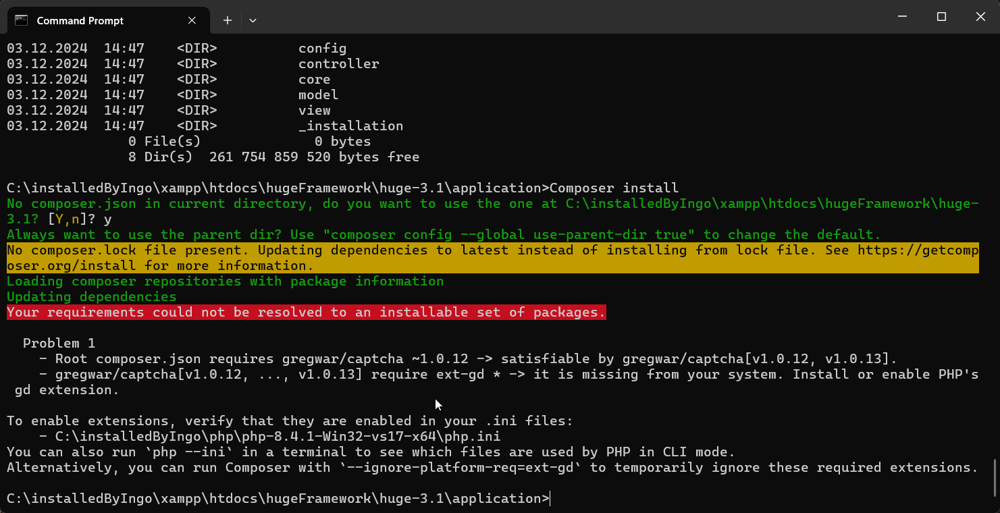
	- Versuch grepwar/captcha zu installieren 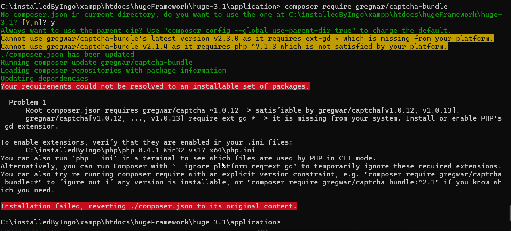
	- php.ini anpassen um extension-gd zu aktivieren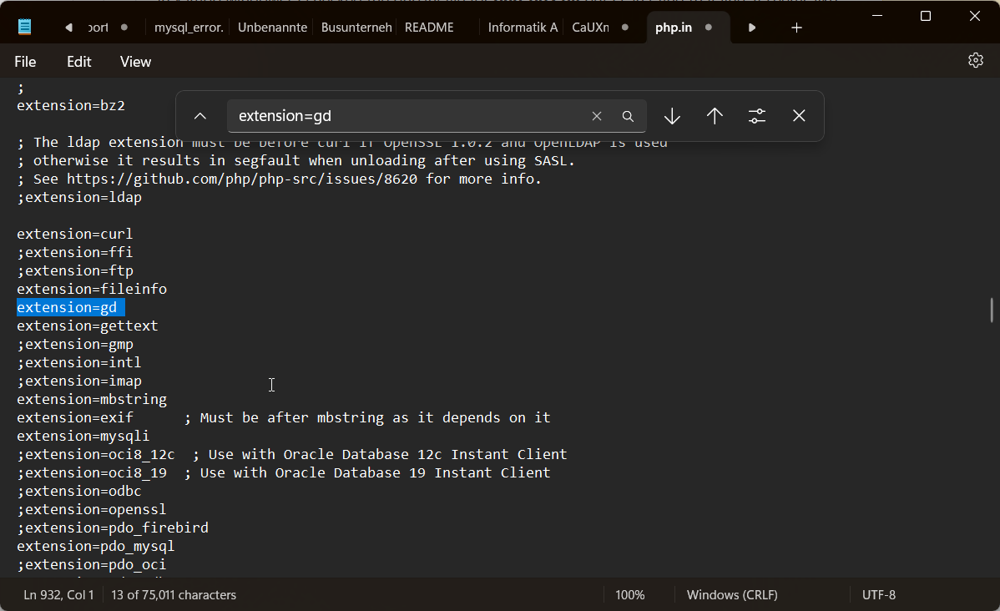
	- hat nichts gebracht -> `Composer install --ignore-platform-req=ext-gd`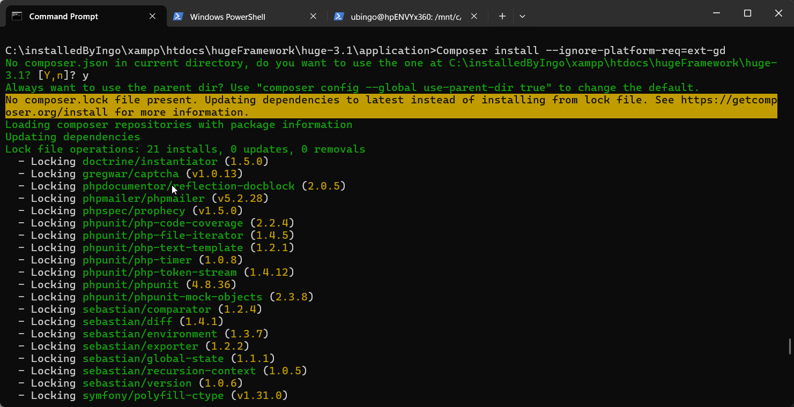
- erfolgreicher install nach [Änderung](#captcha%20benötigt%20extension) der korrekten php.ini 
	- Ordner `public/avatars` nicht mehr read-only setzen 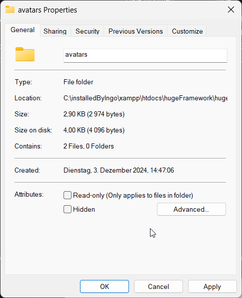
- Email Einstellungen vornehmen
	- For proper email usage: Set SMTP credentials in config file, set EMAIL_USE_SMTP to true
### Mit user "demo" anmelden
- überprüfen, ob demo vorhanden
	- 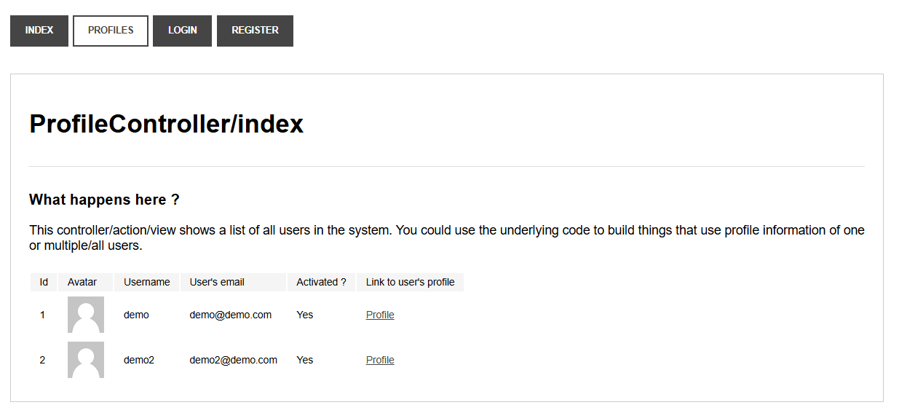
- anmelden
	- 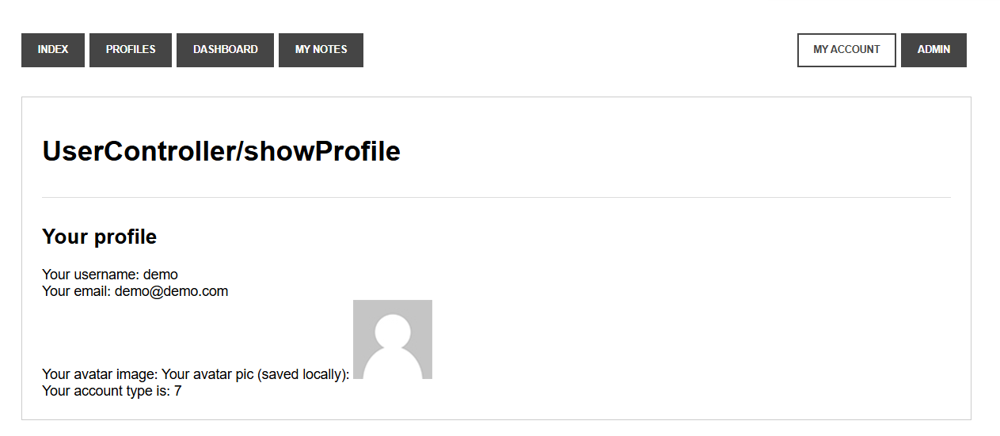
### Testnutzer anlegen
- Probleme mit captcha (besteht auch nach: [captcha benötigt extension](#captcha%20benötigt%20extension))
	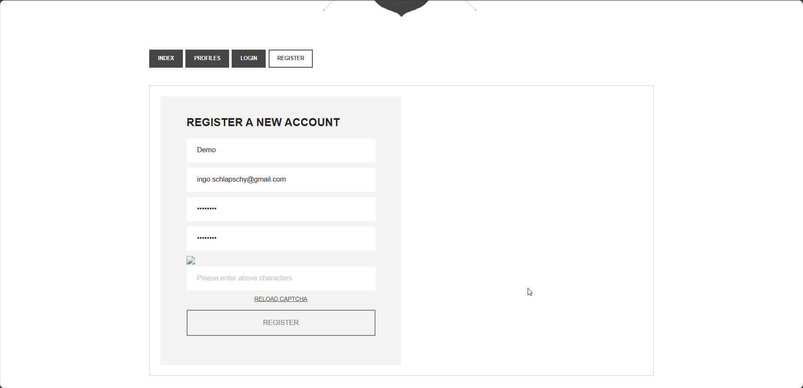
- Problemlösung für: [captcha wird noch immer nicht angezeigt](#captcha%20wird%20noch%20immer%20nicht%20angezeigt)
- captcha funktioniert jetzt
	- 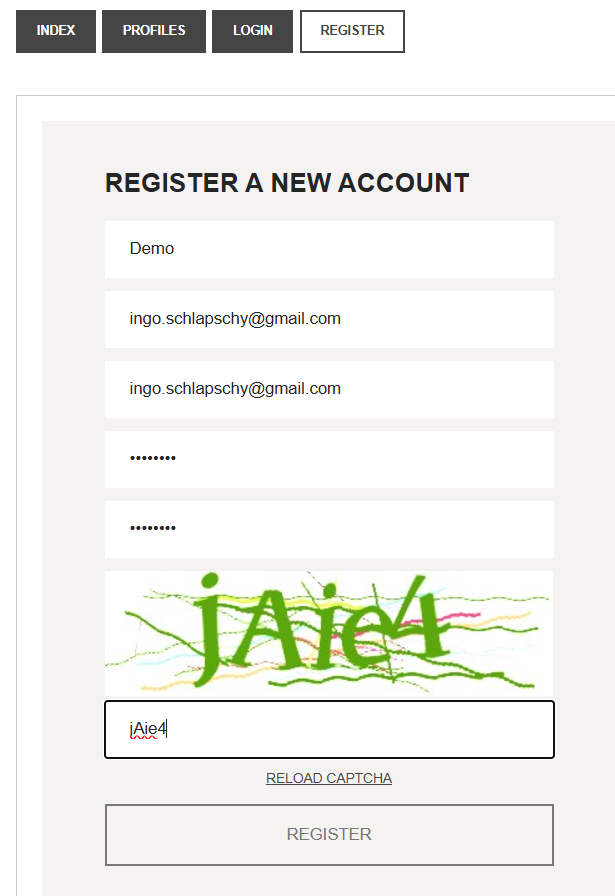
## Lösungen der Probleme
### captcha benötigt extension
- PHP war 2x installiert
	- 1x lokal
	- 1x in xampp
- Composer verwendet die lokale installation
- Die Anpassungen für die Fehlerbehebung wurden aber nur in der xampp version von php.ini angepasst
### captcha wird noch immer nicht angezeigt
- huge 3.1 (stable) deinstallieren
- composer deinstallieren
- installation mit huge 3.3.1 neu starten
## Fragen
### PHP Klassen
```PHP
<?php  
class SimpleClass  
{  
// Deklaration einer Eigenschaft  
public $var = 'ein Standardwert';  
  
// Deklaration einer Methode  
public function displayVar() {  
echo $this->var;  
}  
}  
?>
```
- Wie sieht der Konstruktor in PHP Klassen aus?
```php
__construct(mixed ...$values = ""): void
```
- Wozu dient die „Variable“ $this?
	- Die Pseudovariable `$this` ist verfügbar, wenn eine Methode aus einem Objektkontext heraus aufgerufen wird. `$this` ist eine Referenz auf das aufgerufene Objekt.
- Welche Vorteile hat die Verwendung von OOP in PHP?
	- [PHP: Einführung - Manual](https://www.php.net/manual/de/oop5.intro.php)
	- Man kann die Vorteile von OOP nutzen
		- Verwendung von Klassen
		- Verwendung von Methoden
- Welche Datenkapselungsmethoden gibt es in PHP?
	- private
	- public
- Wie sehen abstrakte Klassen in PHP aus?
	- [PHP: Klassenabstraktion - Manual](https://www.php.net/manual/de/language.oop5.abstract.php)
```php
<?php
abstract class AbstractClass
{
    // Die abgeleitete Klasse zwingen, diese Methoden zu definieren
    abstract protected function getValue();
    abstract protected function prefixValue($prefix);

    // Gemeinsame Methode
    public function printOut()
    {
        print $this->getValue() . "\n";
    }
}
```
## Notizen aus dem Unterricht

## Quellen
- 
