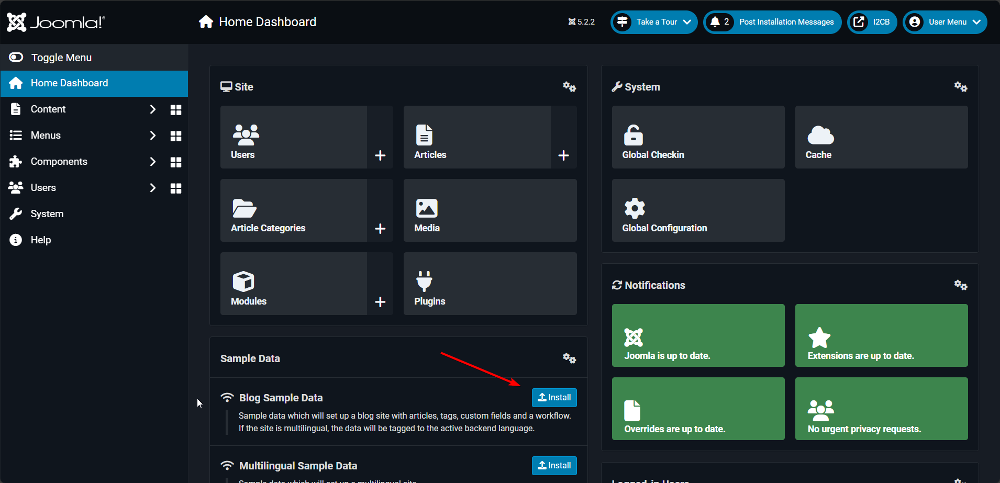
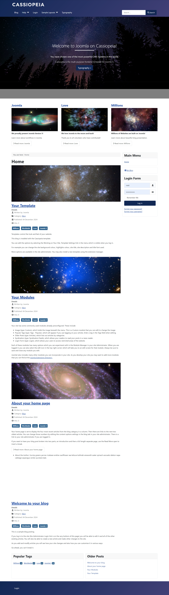
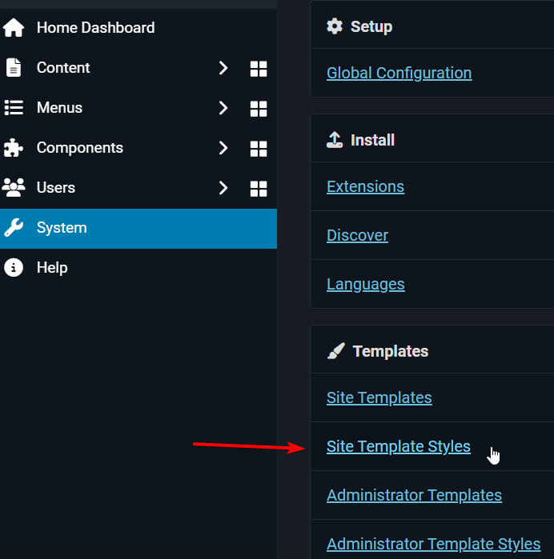
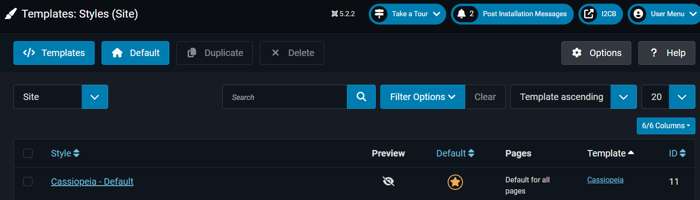
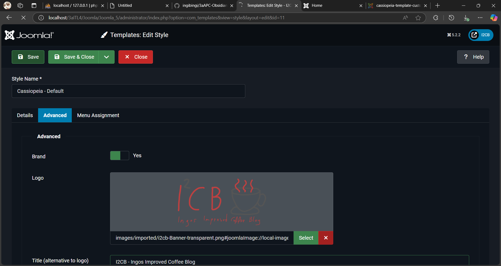

# Joomla 2 - CMS erweitern 
---
- Autor: Ingo Schlapschy
- Schuljahr: 2024/25
- Lehrgang: 2
- Klasse: 3aAPC
- Gruppe: C
- Fach: ITLxx/Informatik
- Datum: 2024-12-04

---
`ToDo: Create Table of Content && Remove this comment`

---
## Angabe

1. Lernziele
• die Begriffe Frontend und Backend erklären können
• Erfolgreich im Backend anmelden können
• Kategorien und Beiträge anlegen können
• die Aufgabe Templates erklären und anwenden können
• das CMS Joomla grundlegend anwenden können

2. Aufgabenstellung
Beschäftigen Sie sich mit den Content Management Systemen, wählen Sie ein Thema für ihre Website und versuchen Sie die Umsetzung der folgenden Aufgaben:
    1. Anlage von 3 Kategorien
    2. Anlage von insgesamt 6 Beiträgen
    3. Änderung der aktuellen Templates
    4. Anlage von 2 weiteren Benutzer (User1 u. User2)
    5. Zuweisung der Rollen von „Autor“ für User 2 und „Publisher“ für User 1

---
### ToDo
- [ ] Joomla installieren (XAMPP musste neue installiert werden)
- [ ] Abgeben
## Lösung
### Joomla (erneut) installieren
- Siehe [20241120074624_ITL4A1 Joomla Grundlagen](20241120074624_ITL4A1%20Joomla%20Grundlagen.md)
### Erste Inhalte erstellen
- Blog mit Sample-Data befüllen
	- 
	- 
### Logo ändern
- 
### Neue Kategorie anlegen
### Logo ändern
System->Templates->Site Template Styles->Cassiopeia - Default->Advanced->Logo

> [!NOTE] Def.: Begriff
> Definition

## Notizen aus dem Unterricht

## Quellen
- 
