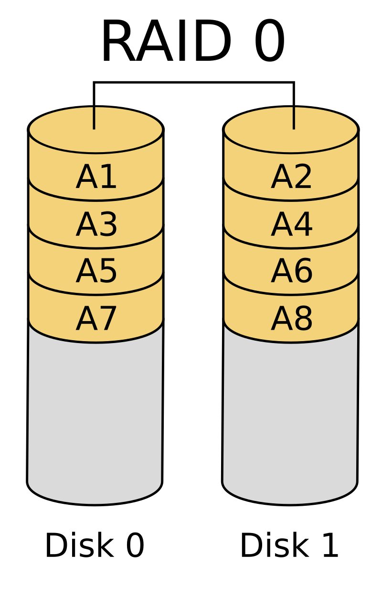

# Raid 0
---
- Autor: 
	- Ingo
	- Alwin
	- Jalda
- Schuljahr: 2024/25
- Lehrgang: 2
- Klasse: 3aAPC
- Gruppe: 
- Fach: DTSM
- Datum: 2024-12-06
---
## Angabe

```
Übersicht über "Raid 0"-Konfiguration geben
```
## Lösung

> Striping
> 
> Daten werden sequentiell in gleich große Blöcke (genannt: "Stripes") aufgeteilt.
> Diese Blöcke können dann unabhängig voneinander gespeichert/gelesen werden.
> Um diese Blöcke wieder in brauchbare Daten umzuwandeln müssen alle dafür nötigen Blöcke in der richtigen Reihenfolge zusammengefügt werden.
### Allgemeines
- Striping: Daten werden aufgesplittet
- Ein Teil der Dateien kommt auf Festplatte A, der andere Teil auf Festlpatte B 
	- bei 2 Festplatten: A und B
- Lässt sich mit anderen Raid-Konfigurationen verknüpfen
	- z.B. um der höheren Ausfallgefahr entgegenzuwirken


> Veranschaulichung von Striping in RAID 0 mit 2 Festplatten
#### Vorteile RAID 0
- schneller
- größere Laufwerke möglich
#### Nachteile RAID 0
- Ausfallgefahr steigt enorm (im Potential)
#### Geschwindigkeit
- Beim lesen/schreiben einer Datei werden gleichzeitig beide Festplatten verwendet 
- Der Vorgang wird (theoretisch) doppelt so schnell.
	- Der tatsächliche Geschwindigkeitszuwachs ist geringer, weil:
		- die Dateien zusätzlich gesplittet/zusammengeführt werden müssen
		- der Zugriff auf beide Festplatten nicht unbedingt exakt gleich schnell erfolgt
		- Die Datei ist nicht 100%ig gleichmäßig in den Stripes auf beiden Platten aufgeteilt.
		- weitere "Kleinigkeiten" die sich zusammenaddieren
- Geschwindigkeit der langsameren Festplatte zählt. 
	- Schnellere Zugriffe auf der schnelleren Festplatte sind "verschenkt".
	- Es muss auf die langsamere Festplatte gewartet werden.
#### Laufwerksgröße
- Es können Laufwerke generiert werden die größer sind als die eigentlichen Festplatten.
	- Die entstehende (virtuelle) Festplatte ist doppelt so groß wie die kleinste verbaute Festplatte.
- Größe der kleinsten Festplatte zählt. Zusätzlicher Platz auf der größeren Festplatte ist "verschenkt".
	- A: 100 GB + B: 100 GB -> 2x100 GB  = 200 GB
	- A: 100 GB + B: 150 GB -> 2x100 GB = 200 GB (50 "extra" GB der größeren Platte "verschenkt")
### Zu beachten
- Fällt eine einzige Festplatte aus, sind alle Daten weg (bzw. unbrauchbar)
- Der Controller (der für das Aufteilen und Zusammenfügen verantwortlich ist) ein Problem, ist eine weitere möglicher Ausfallgefahr.
- Die in einem RAID-System verwendeten Festplatten sollten sich möglichst ähnlich sein
- Verwendung von mehr als 2 Festplatten ebenso möglich
- 3 (gleichartige) Festplatten
	- (theoretisch) 3x so schnell
		- tatsächliche Geschwindigkeitsgewinne sind immer geringer
	- 3x so viel Speicher (im vergleich zu 1 Festplatte)
### Bsp. Ausfallwahrscheinlichkeit
Angenommen eine Festplatte hat (über ihre typische Lebensdauer) eine Ausfallwahrscheinlichkeit von 10% ($\frac{10}{100}=0.1$)
Das heißt sie hat eine Überlebenswahrscheinlichkeit von 90% ($\frac{90}{100}=0.9$)
In einem RAID 0 gilt für:
- 2 Festplatten: $0.9 * 0.9 = 0.81 = 81 \%$ -> Ausfallwahrscheinlichkeit: 19%
- 3 Festplatten: $0.9 * 0.9 * 0.90 \approx 0.73 \approx 73 \%$ -> Ausfallwahrscheinlichkeit: 27%
- 10 Festplatten: $0.9^{10} \approx 0.35 \approx 35\%$ -> Ausfallwahrscheinlichkeit 65%

Und bei Raid 0 heißt ein Ausfall: Alle Daten sind unbrauchbar.

