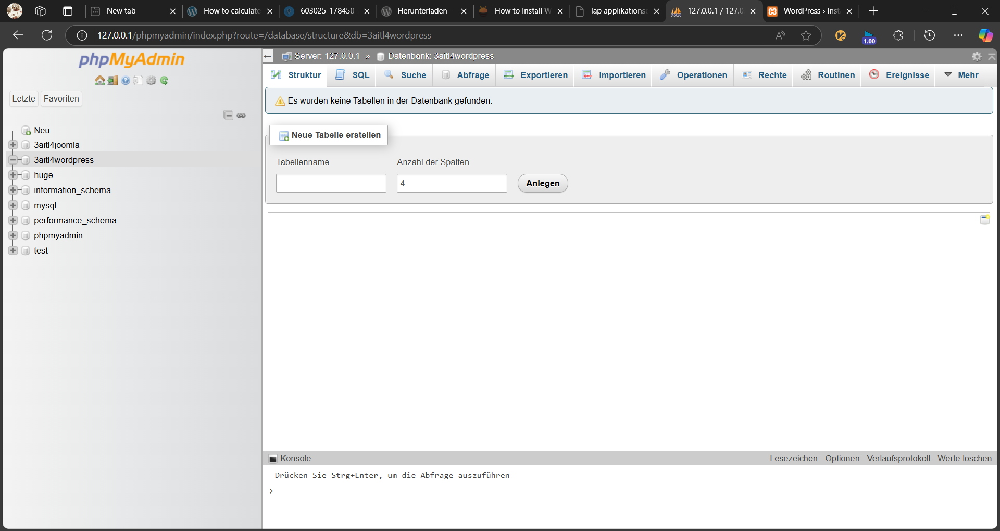
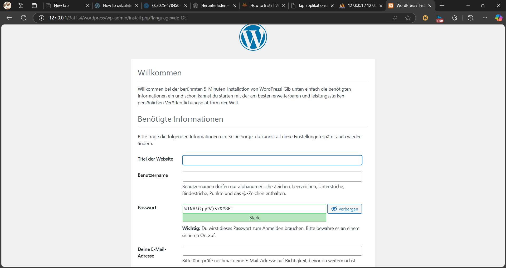
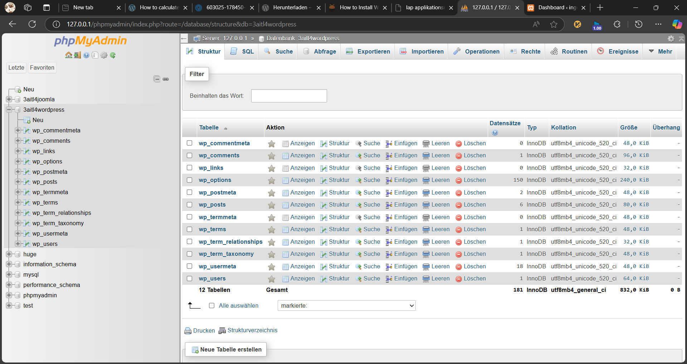

# Installation Wordpress
---
- Autor: Ingo Schlapschy
- Schuljahr: 2024/25
- Lehrgang: 2
- Klasse: 3aAPC
- Gruppe: C
- Fach: ITLxx/Informatik
- Datum: 2024-12-13

---
`ToDo: Create Table of Content && Remove this comment`

---
## Angabe

```
ToDo: Copy and paste here: "Die Angabe"
````

### ToDo
- [ ] ...
- [ ] Abgeben
## Lösung
### Punkt 1

> [!NOTE] Def.: Begriff
> Definition

## Notizen aus dem Unterricht

## Quellen
- 
DB anlegen


localhost.../wp-admin im Webbrowser


DB nach installation
