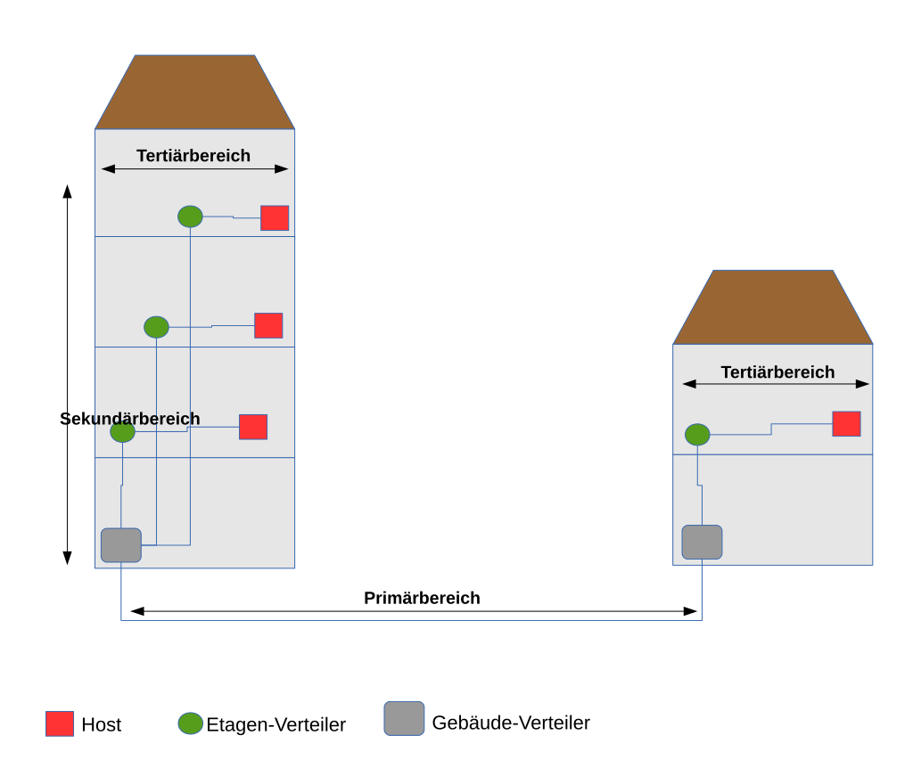
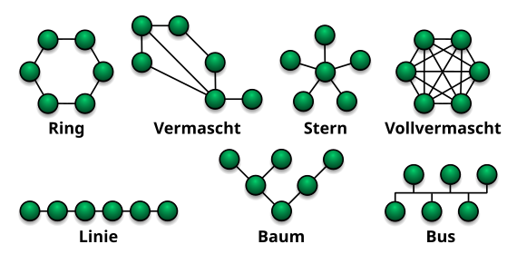

# NameDesThemas
---
- Autor: Ingo Schlapschy
- Schuljahr: 2024/25
- Lehrgang: 2
- Klasse: 3aAPC
- Gruppe: C
- Fach: ITLxx/Informatik
- Datum: 2024-12-13

---
`ToDo: Create Table of Content && Remove this comment`

---
## Angabe

```
* Netzwerkkabelkategorien  
* Funktionen eines Routers  
* Strukturierte Verkabelung  
* Topologien  
* passive Netzwerkkomponenten
```

### ToDo
- [ ] ...
- [ ] Abgeben
## Lösung
### Netzwerkkabelkategorien
- Klassisches "Patch-Kabel"
	- RJ-45 Stecker
	- Twisted-Pair-Kabel
	- Kupferkabel
- Crosskabel
	- Vertauschen von Adern an einem Steckerende
	- Zur direkten Kommunikation zwischen 2 Endgeräten
		- ohne z.B. Switch dazwischen
	- Durch Auto-Crossover inzwischen großteils obsolet
#### CAT-Kategorien
CAT-1 bis CAT-4 nicht mehr aktuell
CAT-5 Bis zu 100 Mbit/s
CAT-5e Bis zu 1Gbit/s
CAT-6 Bis zu 10 Gbit/s
CAT-6e längere Distanzen
CAT-7 Bis zu 10 Gbit/s
CAT-8 Bis zu 25 Gbit/s
#### Nomenklatur
XX/YZZ
- XX...Außenabschirmung (Außenhülle der Kabel)
	- U...Ungeschirmt
	- F...Folienschirm
	- S...Geflechtschirm
	- SF...Geflecht & Folienschirm
- Y...Adernabschirmung (Einzelne Leiter des Kabel)
	- U...Ungeschirmt
	- F...Folienschirm
	- S...Geflechtsschirm
- ZZ...Kabelausführung
	- TP...Twisted Pair
	- QP... Quad Pair
#### Sonstige Kabelformen
- Koaxial-Kabel
- Lichtwellenleiter-Kabel
	- Glasfaser
### Funktionen eines Routers
- Kommunikation auf OSI-Schicht 3 (Network)
- Leitet Pakete weiter
- Weiterleitung mittels IP-Adresse
- Weiß, in welche Richtung die gesuchte IP zu finden ist.
- Leitet Pakete weiter
- Verbindet Netzwerke miteinander
- Lösungen integrieren of weitere Funktionalitäten
	- Switch
	- Firewall
	- DHCP-Server
### Strukturierte Verkabelung
- Verkabelung zwischen Räumlichkeiten
- Ziel:
	- einfache, verlässliche, erweiterbare Struktur aufbauen
- Primärbereich
	- Verkabelung zwischen Gebäuden
	- häufig Glasfaser
- Sekunderbereich
	- Verkabelungen zwischen Sektionen/Etagen
	- häufig Twisted-Pair Kabel
- Tertiärbereich
	- Verkabelung zu Endgeräten
	- fast ausschließlich Twisted Pair Kabel

### Topologien
#### Verbindungsformen
- Punkt zu Punkt
- Punkt zu Multipunkt
#### Typische Ausbauformen
- Ring
- Stern
- Linie
- Bus
	- wenige Kabel nötig
	- nur eine Übertragung gleichzeitig
- Baum
- Vollvermascht

- Durchmesser
	- Maximaler Abstand zwischen 2 Punkten (Hops)
- Grad
	- Anzahl der Links pro Knoten
	- Haben alle Knoten im Netzwerk den selben Grad, spricht man von einem regulären Netz
- Bisektionsweite
	- Minimale Anzahl der Verknüpfungen die aufgetrennt werden müssten um das Netz in 2 Netze zu halbieren
- Symmetrie
	- Netz sieht von jedem Knoten aus gleich aus (z. B. Ring/Vollvermascht)
- Skalierbarkeit
	- ???
- Konnektivität
	- Minimale Anzahl der Trennungen um das Netz zu zerstören
	- (entsprecht Mindestanzahl der unabhängigen Wege)
### passive Netzwerkkomponenten
- Geräte die keine Stromversorgung benötigen
- Kabel
	- überträgt Daten
- Anschlussbuchsen
	- 
- Patch-Panel
- Racks
- Simple Switches

> [!NOTE] Def.: Begriff
> Definition

## Notizen aus dem Unterricht

## Quellen
- 
