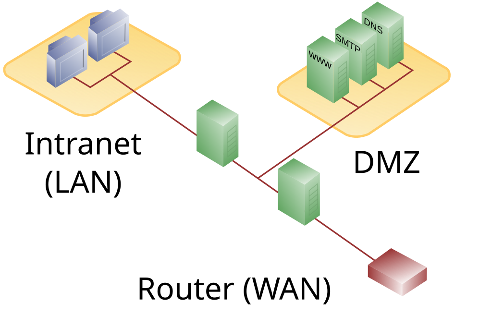
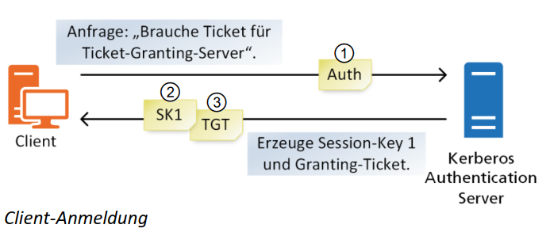

# Netzwerksicherheit & Neztzwerktechnik
---
- Autor: Ingo Schlapschy
- Schuljahr: 2024/25
- Lehrgang: 2
- Klasse: 3aAPC
- Gruppe: C
- Fach: DTSM
- Datum: 2024-12-17

---
## Angabe

1. Grundlagen Netzwerktechnik
	- Übersicht zu Grundfunktionen einer Firewall erstellen
	- 3 Schutzmechanismen für Netzwerke aufzählen
	- Hacking: Mögliche Angriffspunkte nennen und beschreiben
	- Datenabflusspunkte im Kontext Internetnutzung wiedergeben können
	- Protokoll zur Synchronisierung nennen  
	- Zeitsynchronisierung in Serversystemen beschreiben und begründen
2. Fragen Netzwerksicherheit
	- Welche prinzipielle Aufgabe hat eine Firewall?
	- Welche 2 prinzipiellen Funktionsweisen einer Firewall kennen Sie? – kurze Erklärung!
	- Was ist und welche Aufgabe hat eine „DMZ“ im Kontext Netzwerksicherheit?
	- Was versteht man unter einem „IDS“ im Kontext Netzwerksicherheit?
	- Was versteht man unter einem „IPS“ im Kontext Netzwerksicherheit?
	- Was sind die aktuell 3 häufigsten Bedrohungen der Netzwerksicherheit?
	- Was versteht man unter Malware?
	- Was versteht man unter „ Advanced Persistent Threats (APT)”?
	- Was versteht man unter “DDoS-Angriffe (Distributed Denial of Service)“?
	- Was versteht man unter einem „Angriffsvektor“ im Kontext Netzwerksicherheit?
	- Was versteht man unter „Ransomware“ – im Kontext Malware -  Erklärung anhand Beispiel?!
	- Was versteht man unter „Phishing“ – im Kontext Malware -  Erklärung anhand Beispiel?!
	- Was versteht man unter der „Zero-Day-Lücke“? – mit welchen Fristen wird in diesem Zusammenhang üblicherweise gerechnet?
	- Zu welchem Zeitpunkt spricht man von einer „N-Day-Schwachstelle“ im Kontext Zero-Day-Lücke?
	- Welche Maßnahmen können ergriffen werden um „Zero-Day-Exploits“ zu verhindern?
	- Was versteht man unter einem „White-, Grey-, Black-Hat“ – Hacker?
	- Nennen Sie 5 Methoden von Hackern und erklären Sie diese kurz!
	- Wie können Angriffe seitens IDS/IPS erkannt werden?
	- Was ist die Grundlage einer Authentifizierung?
	- Was versteht man unter einer Zweifaktor-Authentifizierung (2FA)?
	- Was versteht man unter einer Multifaktor-Authentifizierung (MFA)?
	- Welche Aufgabe hat Kerberos bzw. welches Ziel wurde bei der Entwicklung von Kerberos verfolgt?
	- Welche Eigenschaften weist Kerberos auf – kurze Erklärung?!
	- Wie läuft die Kerberos-Authentifizierung prinzipiell ab?
	- Welche 2 Vorteile werden durch Kerberos erreicht?
	- Wie werden Replay-Angriffe verhindert?
	- Warum ist es wichtig das in einem Netzwerk alle Systeme die gleiche Uhrzeit haben?
	- Was versteht man unter einem Token bzw. Token-Karten im Kontext Authentifizierung?
	- Welchen Vorteil bieten Tokensysteme gegenüber einer Smart-Card-Lösung?
	- Welchen Vorteil bietet ein Hardware-Token?
---
## Lösung
### Netzwerktechnik allgemein
- Übersicht zu Grundfunktionen einer Firewall erstellen
- 3 Schutzmechanismen für Netzwerke aufzählen
- Hacking: Mögliche Angriffspunkte nennen und beschreiben
- Datenabflusspunkte im Kontext Internetnutzung wiedergeben können
- Protokoll zur Synchronisierung nennen  
- Zeitsynchronisierung in Serversystemen beschreiben und begründen
### Netzwerksicherheit Fragen
#### Welche prinzipielle Aufgabe hat eine Firewall?
- Ein Netzwerk vor ungewünschtem Traffic schützen
- Sprich: schützt vor ungewünschten Zugriff
#### Welche 2 prinzipiellen Funktionsweisen einer Firewall kennen Sie? – kurze Erklärung!
- External Firewall
	- Grenzt das eigene (sichere) Netz von außen (unsicher) ab.
	- Lässt nur "sicheren" Traffic durch
	- Netzwerke lassen sich in unterschiedlich "sichere" Bereiche abgrenzen
- Personal Firewall
	- Überprüft den Traffic an einem Endgerät
#### Was ist und welche Aufgabe hat eine „DMZ“ im Kontext Netzwerksicherheit?
- DMZ... DeMilitarised Zone
- "Sicherer" Bereich eines Netzwerks
- Kommunikation nach Außen ist eingeschränkt
	- z. B. durch Firewall
- DMZ beinhaltet oft Inhalte, die öffentlich zugänglich gemacht werden müssen
- Empfehlung: Abschottung sowohl nach Innen und nach außen
  
#### Was versteht man unter einem „IDS“ im Kontext Netzwerksicherheit?
- IDS...Instrusion Detection System
- Wichtiges Element für eine DMZ
- Erkennt falls diese kompromittiert wurde
- Relevante Frage: Wie gut ist die Erkennung?
	- False Positive
	- False Negative
#### Was versteht man unter einem „IPS“ im Kontext Netzwerksicherheit?
- IPS... Instrusion Prevention System
- Reagiert bei komprommitierung der DMZ
---
#### Was sind die aktuell 3 häufigsten Bedrohungen der Netzwerksicherheit?
>lt. https://www.computerweekly.com/de/tipp/Netzwerksicherheit-Die-3-groessten-Gefahren-und-ihre-Abwehr
- Malware
- Advanced Persistent Threats (APT)
- Distributed Denial of Services (DDoS)
#### Was versteht man unter Malware?
- Unerwünschte Software die gewöhnlicherweise Schaden verursacht
	- Viren
		- Programmcode
		- infiziert andere Dateien
		- vervielfältigt sich selbständig
	- Würmer
		- Programm
		- vervielfältigt sich selbständig
	- Trojanische Pferde
		- Programm
		- KEINE selbständige Vervielfältigung
#### Was versteht man unter „ Advanced Persistent Threats (APT)”?
- Koordinierte Angriffe auf ein Ziel
#### Was versteht man unter “DDoS-Angriffe (Distributed Denial of Service)“?
- DoS-Angriffe, die koordiniert von mehreren Positionen ausgeführt werden.
#### Was versteht man unter einem „Angriffsvektor“ im Kontext Netzwerksicherheit?
- Methode um eine Sicherheitslücke auszunutzen
#### Was versteht man unter „Ransomware“ – im Kontext Malware -  Erklärung anhand Beispiel?!
- Angreifer erhält Zugriff auf wichtige Daten
- Angreifer verschlüsselt die Daten
- Angreifer fordert Lösegeld für den Zugriff auf die eigenen Daten
#### Was versteht man unter „Phishing“ – im Kontext Malware -  Erklärung anhand Beispiel?!
- "Enkeltrick"
- Website, E-Mail, Werbebanner, Anruf etc.
- Ausgabe als das Original, um z. B. Passwörter zu erschleichen
#### Was versteht man unter der „Zero-Day-Lücke“? – mit welchen Fristen wird in diesem Zusammenhang üblicherweise gerechnet?
- Neue (bisher unbekannte) Lücke
- Lücke noch nicht länger als 24h bekannt
- Noch kaum Gelegenheit sich gegen Angriffe zu verteidigen
#### Zu welchem Zeitpunkt spricht man von einer „N-Day-Schwachstelle“ im Kontext Zero-Day-Lücke?
- Lücke, für die es bereits einen Fix gibt
- Patch wurde auf Zielsystem noch nicht implementiert
#### Welche Maßnahmen können ergriffen werden um „Zero-Day-Exploits“ zu verhindern?
- Sicherheitsstandards einhalten
- Pen-Tester engagieren
- schnell patchen
#### Was versteht man unter einem „White-, Grey-, Black-Hat“ – Hacker?
- White
	- Bewegen sich im gesetzlichen Rahmen
- Grey
	- Bewegen sich außerhalb des gesetzlichen Rahmens
	- Keine böswillige Absicht
- Black
	- Bewegen sich außerhalb des gesetzlichen Rahmens
	- Haben böswillige Absicht		- 
#### Nennen Sie 5 Methoden von Hackern und erklären Sie diese kurz!
- APT
- DDOS
- Ransomware
- Phishing
- Malware
#### Wie können Angriffe seitens IDS/IPS erkannt werden?
- Durch Heuristiken Muster erkennen
- Vergleich Headerinformationen
- Vergleich Signaturen 
---
#### Was ist die Grundlage einer Authentifizierung?
- Abgleich von Muster und Abfrage
- Mögliche Kriterien
	- Sein
		- Fingerabdruck
		- Face ID
	- Wissen
		- Passwort
		- Rätsel (zumindest wenn man einen DnD-Dungeon konstruiert)
	- Haben
		- Dongle
		- Smartphone-App
		- Schlüssel (Physikalischer)
#### Was versteht man unter einer Zweifaktor-Authentifizierung (2FA)?
- 2 Abfragen werden kombiniert
	- optimalerweise unterschiedliche Kriterien
#### Was versteht man unter einer Multifaktor-Authentifizierung (MFA)?
- Mehrere Abfragen werden kombiniert
	- optimalerweise unterschiedliche Kriterien
#### Welche Aufgabe hat Kerberos bzw. welches Ziel wurde bei der Entwicklung von Kerberos verfolgt?
- Ist ein Authentifizierungsprotokoll
- Client und Server können jeweils eine Authentifizierung fordern.
- Kennwörter nicht in Klartext übertragen
- verschlüsseltes Ticketsystem
#### Welche Eigenschaften weist Kerberos auf – kurze Erklärung?!
- Gegenseitige Authentifizierung
	- sowohl Client als auch Server können eine Authentifizierung des Anderen fordern
- Effizient
	- Client zeigt Ticket
	- Server überprüft Ticket
- Weiterreichung der Authentifizierung
	- Einmalige Anmeldung reicht für Gewährung auf sämtliche zustehende Funktionen
- Transitivität
	- A vertraut B und
	- B vertraut C
	- daraus folgt:
		- A vertraut C
- (Standardmäßig) Beiderseitiges Vertrauensverhältnis
	- A vertraut B
	- daraus folgt:
		- B vertraut A
- Interoperabilität
	- Funktioniert auf UNIX und Windows
- Keine Klartextübertragung von Kennwörtern
	- Authentifizierung über Ticketsystem
- Verwendet Symmetrische Verschlüsselung
#### Wie läuft die Kerberos-Authentifizierung prinzipiell ab?
- Server muss Kerberos Server vertrauen
- Client muss Kerberos Server vertrauen
##### Client
- Anfrage an Kerberos Authentication Server (KAS)
	- beinhaltet verschlüsseltes Client-Passwort
##### Kerberos Authentication Server
- Überprüfung Passwort (Datenbank)
- SK1 generieren
	- SK1... Session Key 1
- SK1 mit Client-Schlüssel verschlüsseln
- TGT erstellen und verschlüsseln:
	- TGT... Ticket Granting Ticket
	- beinhaltet
		- verschlüsselten SK1
		- Timestamp, etc.
- TGT an Client senden

##### Client
- Anfrage an Ticket Granting Server (TGS)
	- Beinhaltet:
		- Mit SK1 verschlüsselte Nutzerdaten
		- TGT
##### Ticket Granting Server
- Entschlüsselt von Client empfangene Daten
- Überprüft damit:
	- Client hatte sich korrekt bei KAS gemeldet
		- Beweis: TGT vorhanden
	- Client ist wirklich der Client
		- Beweis: SK1 vorhanden
- Session Ticket **für Zielserver** erstellen
	- SK2 erstellen
	- Mit SK1 verschlüsseln
#ToDo/Finish
##### Client
- Sendet SK2 an Zielserver
##### Server
- Überprüft SK2
- sendet SK2 an Client zurück
##### Erklärungen Stunde
- 
#### Welche 2 Vorteile werden durch Kerberos erreicht?
- Viele Endgeräte in einem Netzwerk können sich gegenseitig autentifizieren, ohne dass dafür jedes mal eine neuer Schlüsselaustausch (mit übertragung von Passwörtern) durchgeführt werden muss
- Single Sign-On
- Keine übertragung von unverschlüsselten Passwörtern
- Symmetrische Verschlüsselung ist sicherer gegen Quantencomputer
	- [Taming Kerberos - Computerphile](https://www.youtube.com/watch?v=qW361k3-BtU)
#### Wie werden Replay-Angriffe verhindert?
- Replay-Angriffe
	- Versendetes, gehashtes Passwort wird abgegriffen.
		- Man kann nun den Hash zur Anmeldung verwenden.
- Nonce
	- Beim Hashing wird dem Text eine Zeichenfolge angefügt
		- Dadurch entsteht ein anderer Hash
	- die verwendete Zeichenfolge wird zusätzlich als Klartext mitgesendet
	- Der Server akzeptiert jede nonce nur 1x
#### Warum ist es wichtig das in einem Netzwerk alle Systeme die gleiche Uhrzeit haben?
- Kerberos akzeptiert keine "alten" Zertifikate
	- ... oder zukünftige
- Ansonsten
	- Als Nonce bieten sich Timestamps an, da die verwendeten nonces nicht extra gespeichert werden müssen.
	- Wegen Latenzen müssen Zeitfenster statt Zeitpunkte verwendet werden.
	- Innerhalb dieser Zeitfenster besteht Anfälligkeit für Replay-Angriffe
#### Was versteht man unter einem Token bzw. Token-Karten im Kontext Authentifizierung?
- Authentifizierungstoken
	- Sind Alternative/Ergänzung zu Passwort
	- Gelten oft nur begrenzt (1x/innerhalb Zeitraum)
- Token-Karte
	- Gerät, das Authentifizierungstoken erstellt/bereit stellt
	- z. B. Athenticator-App
#### Welchen Vorteil bieten Tokensysteme gegenüber einer Smart-Card-Lösung?
- Smart-Card beinhaltet bloß Anmeldedaten
	- Kann abgegriffen werden
#### Welchen Vorteil bietet ein Hardware-Token?
- "Schlüsselanhänger" der selbständig Token generiert
- Authentifizierung mit "haben"
	- kann nicht einfach digital kopiert werden (gültigkeit zeitlich begrenzt)

## Notizen aus dem Unterricht

## Quellen
- 
