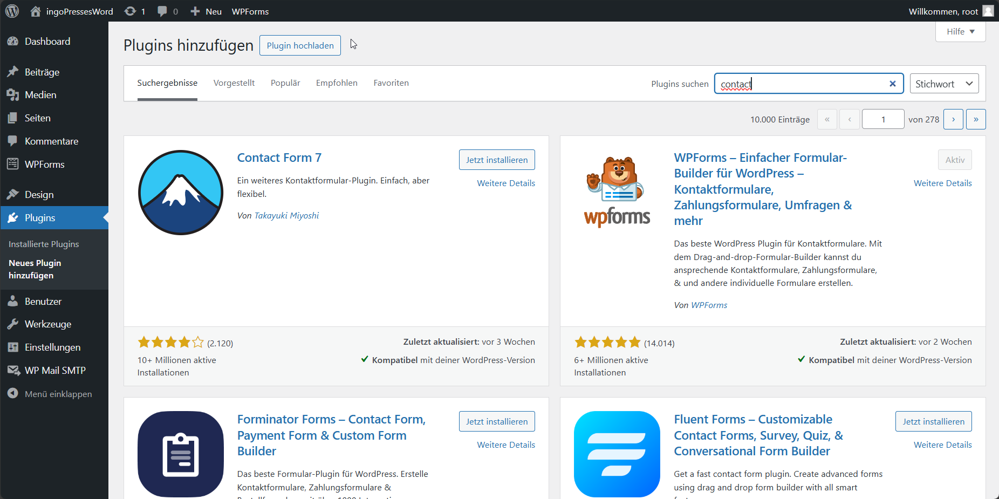
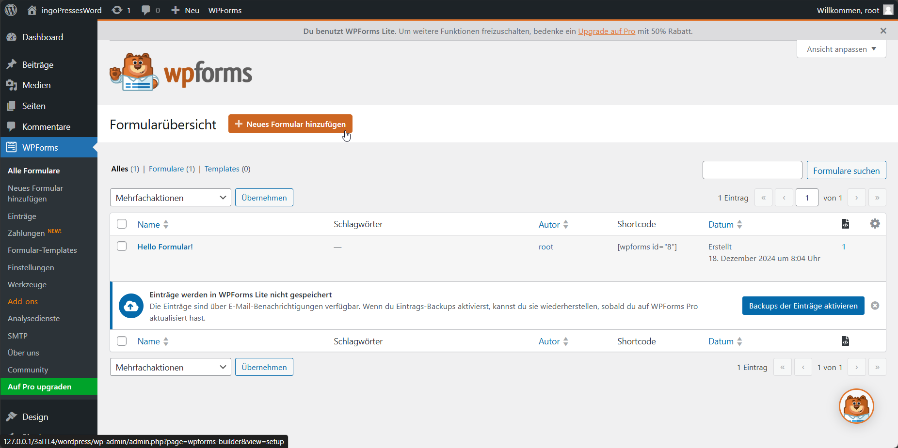
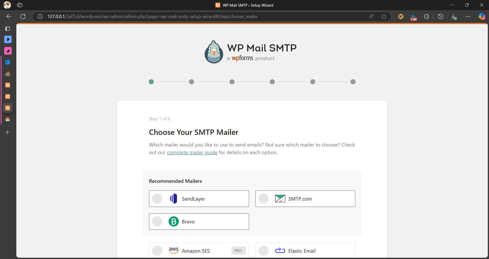

# NameDesThemas
---
- Autor: Ingo Schlapschy
- Schuljahr: 2024/25
- Lehrgang: 2
- Klasse: 3aAPC
- Gruppe: C
- Fach: ITL4
- Datum: 2024-12-18

---
## Angabe
- Beschäftigen Sie sich mit Content Management System WordPress.
- Erstellen ein einfaches Kontaktformular mittels PlugIn (zum Vergleich)
- Erstellen Sie ein einfaches Formular, welches die Daten in eine zuvor erstellte SQL-Datenbank einfügt.
- Das Ziel ist es zuerst ein HTML Formular mittels normalem Editor (als HTML bearbeiten) eingefügt werden


- Der Submit ist in einer PHP Datei (des Themes) zu erkennen und danach der INSERT in die eigene Datenbank durchzuführen

- Die Übung sollte aufbauend auf die Laborübung SQL-Ausgabe in Wordpress sein – verwenden Sie die gleiche Datenbank.
- Verwenden Sie die „mysqli“ oder „PDO“ Klasse, um eine Verbindung zur Datenbank herzustellen.
- Tipp: Versuchen Sie zuerst eine DB-Eingabe über eine einfache Internet-Seite, zB: „index.php“, herzustellen.
---

### ToDo
- [ ] ...
- [ ] Abgeben
## Lösung
### Kontaktformular erstellen
#### Plugin installieren
WPForms-Plugin installieren

#### Kontaktformular erstellen

- Template Auswählen
Schritt für Schritt-Anleitung folgen
##### Versuch SMTP einzurichten für Bestätigungs-Mail


- benötigt Google-Cloud, vorerst zu umständlich
	- Grundeinstellungen beibehalten
### Datenbank erstellen
- mittels phpmyadmin
```mysql
CREATE TABLE `kontaktformular`.`kontakte` (`ID` INT NOT NULL AUTO_INCREMENT , `Vorname` VARCHAR(50) NOT NULL , `Nachname` VARCHAR(50) NOT NULL , `email` VARCHAR(255) NOT NULL , `text` TEXT NOT NULL , `refnr` INT NOT NULL , PRIMARY KEY (`ID`), UNIQUE (`ID`)) ENGINE = InnoDB;
```
### Datenbank einbinden
>Ausgabe der Datenbank auf einer seite

#### Plugin installieren

php code schreiben
AnleitungQuelle: [PHP MySQL Select Data](https://www.w3schools.com/php/php_mysql_select.asp)


## Notizen aus dem Unterricht

## Quellen
- 
