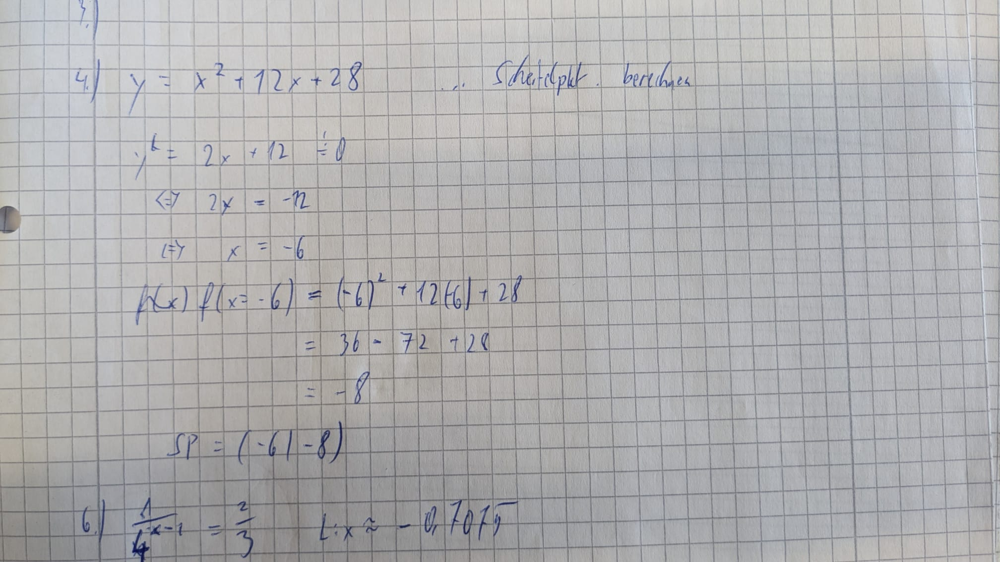
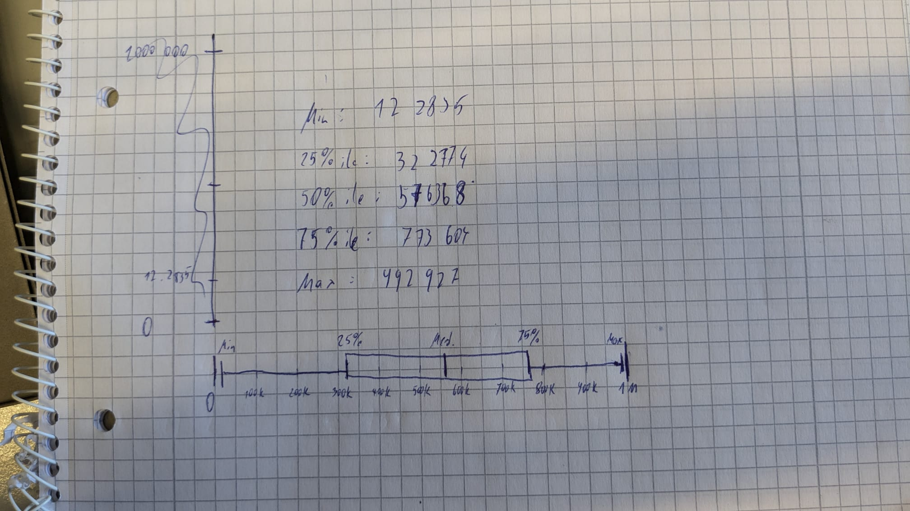

# Zusammenfassung
---
- Autor: Ingo Schlapschy
- Schuljahr: 2024/25
- Lehrgang: 2
- Klasse: 3aAPC
- Gruppe: C
- Fach: ITLxx/Informatik
- Datum: 2025-01-13

---
`ToDo: Create Table of Content && Remove this comment`

---
# Binärzahlen umrechnen
## Digitale Notizen

## Handschriftlich

# Quadratische Gleichungen und Funktionen
## Digital

---

---

## Handschriftlich

# Logarithmus
## Digital
#ToDo 
	## Handschriftlich

# Verbesserung Schularbeit

- einziges Beispiel mit Fehler (hatte ein Minus vergessen)
# Box Plot
## Zuvällige Werte
816932.61	229290.77	149583.81	584012.13	908373.97	804957.09	546349.73	569057.43	281019.88	787437.73	709214.76	122835.13	141244.13	233411.47	529866.92	917510.97	710052.87	390557.44	239221.54	825924.83	942431.61	521041.34	589604.74	269532.02	196938.32	588055.63	631476.95	574482.77	322774.79	702787.15	267672.39	228018.19	929387.49	323924.85	520538.81	347049.16	701507.13	193136.94	734601.13	303391.76	468614.16	964446.61	238967.43	773604.98	957133.94	788294.73	672013.93	945887.66	626228.41	682080.48	448908.89	152798.54	565765.06	594296.52	318018.27	538204.55	482789.87	818112.06	563662.98	946735.10	129430.14	898052.14	444347.53	741553.73	624733.23	674359.12	352879.35	739738.32	832420.27	283681.01	269602.37	672739.66	850682.25	859396.75	741452.40	731249.87	374696.44	287897.22	992927.62	270407.23	792692.88	794588.23	576368.94	216728.97	360081.89	842735.27	429832.77	818749.79	980694.89	221798.52	486568.89	817585.79	345551.60	773014.53	404540.73	459948.82	162235.17	658866.77	729902.68	603406.19

## Aufbereitete Werte
- Der Größe nach sortiert

