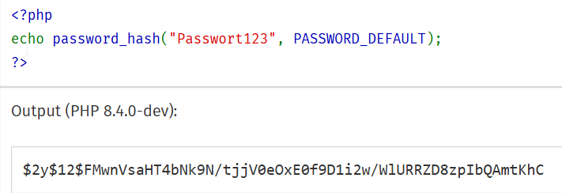

# Hashing
---
- Autor: Ingo Schlapschy
- Schuljahr: 2024/25
- Lehrgang: 2
- Klasse: 3aAPC
- Gruppe: C
- Fach: Informatik
- Datum: 2025-01-20

---
## Message Digest (eindeutiger Fingerprint)
- Erstellt aus beliebiger Nachricht (Länge egal) einen Hashwert
	- MD5: erstellt immer 128 Bit Hashwert
- Höchst unwahrscheinlich, dass 2 unerschiedliche Nachrichten den selben Wert ergeben (Kollision)
- Ähnliche Nachrichten haben komplett unerschiedliche Hashes
- Einwegfunktion: 
	- Aus dem selben Text entsteht immer der selbe Hash
	- Aus dem Hash lässt sich der originale Text NICHT erstellen
## SHA-256
- Secure Hashing Algorithmus
## Salting
- Einem Text (Password) wird, bevor es gehasht wird ein String angehängt und als Klartext zusätzlich zum gehashten Passwort gespeichert
- User mit dem Selben Passwort haben unterschiedliche Hashes
- Jedes Passwort mit eigenem Salt-Wert versehen. Sonst haben 2 User die das Selbe Passwort haben den selben Hash
- Zusätzlich gesamte Spalte mit (selben) Wert salzen
	- Verwendung von Rainbow-Tables wird unmöglich
		- Liste von gehashten, häufigsten Passwörtern
## Praxis-Beispiel
### php
- https://www.php.net/manual/de/function.password-hash.php
- in huge ` $user_password_hash = password_hash($user_password_new, PASSWORD_DEFAULT);`
- 
- Der String `""` wird zu `$2y$12$6jyRBvQEkesxhMYRrwCK9.2N.XRWUjYvLbiq93vDjS30onNFrmCEe`