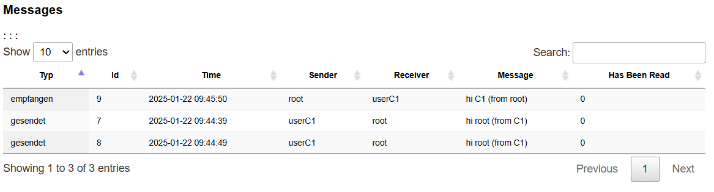
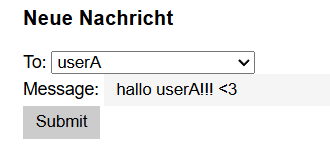
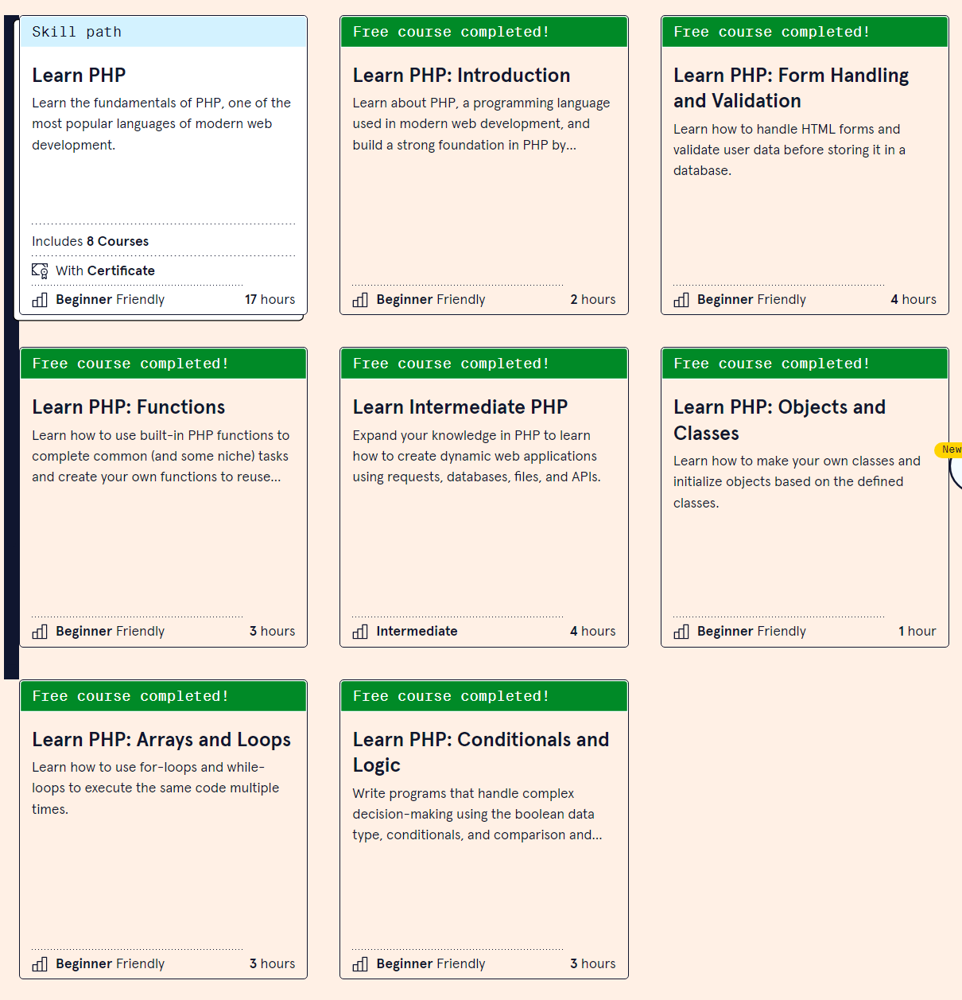

# Messenger (HUGE Framework)
---
- Autor: Ingo Schlapschy
- Schuljahr: 2024/25
- Lehrgang: 2
- Klasse: 3aAPC
- Gruppe: C
- Fach: ITL12
- Datum: 2025-01-22

---
## Angabe
```
     1. Integration eines Messenger Dienstes (nicht LIVE)
Es ist eine DB Tabelle für Nachrichten von Benutzer an Benutzer integriert werden. 

    • Erstelle hierzu ein ER-Diagramm für notwendige(n) Tabelle(n).

    • Danach soll eine Nachricht an bestimmte Benutzer (einzeln) geschickt werden können. (Eingabe via URL zum Testen)

    • Im letzten Schritt geht es darum einen Menüpunkt im Hauptmenü (oben) zu integrieren  über „Profiles“ lösen ist auch eine Möglichkeit
        ◦ Bei „Profiles“ den eigenen User ausblenden

    • Dort sollen noch nicht gelesene Nachrichten (Anzahl mit rotem Kreis) angezeigt werden.  kann auch beim Namen in der Profiles-Ansicht gemacht werden

    • Versuch ein Messenger Fenster zu bauen, welches eine Liste von Nachrichten (links Gesprächspartner, rechts meine Nachrichten) anzeigt.
CSS Vorlage: https://codepen.io/jmpp/pen/mprGZo


    2. Versandt von Nachrichten an Gruppen
Es soll eine Möglichkeit geben, Nachrichten an bestimmte Gruppen, z.B. Administratoren, zu senden. 
Alternativ kann natürlich auch eine komplexe Lösung mit variablen - selbst zu erstellenden Gruppen - integriert werden (KEINE VORAUSSETZUNG – FREIWILLIG)
```

## Lösung
### Messenger View
- neu erstellte Datei
	- Vorlage: view/login/index.php
- Zeigt die Nachrichten, die der angemeldete user
	- gesendet hat
	- empfangen hat

- Beinhaltet Form, das einen eine neue Nachricht verfassen lässt.
	- Methode: post
	- Mögliche Empfänger sind die anderen user
		- Auswahl über Dropdown
	- action=
		- funktion new_message() ausführen
			- aus controller/MessengerController.php

#### view/messenger/index.php
```php
<div class="container">
    <h1>Messenger</h1>
    <div class="box">

        <!-- echo out the system feedback (error and success messages) -->
        <?php $this->renderFeedbackMessages(); ?>

        <h3>Messages</h3>
        <table id="messageTable" class="js-table display">
            <thead>
                <tr>
                    <th>Typ</th>
                    <th>Id</th>
                    <th>Time</th>
                    <th>Sender</th>
                    <th>Receiver</th>
                    <th>Message</th>
                    <th>Has Been Read</th>
                </tr>
            </thead>
            <tbody>
                <?php foreach ($this->messages as $message) { ?>
                    <tr class="<?= ($message->messages_receiver_name == Session::get("user_name") ? 'highlight' : ''); ?>">
                        <td><?php if($message->messages_receiver_name == Session::get("user_name")){echo("empfangen");}else{echo("gesendet");} ?></td>
                        <td><?= $message->messages_id; ?></td>:
                        <td><?= $message->messages_time; ?></td>
                        <td><?= $message->messages_sender_name; ?></td>
                        <td><?= $message->messages_receiver_name; ?></td>
                        <td><?= $message->messages_message; ?></td>
                        <td><?= $message->messages_hasBeenSeen; ?></td>
                    </tr>
                <?php } ?>
            </tbody>
        </table>
        <h3>Neue Nachricht</h3>
        <form action="<?php echo Config::get('URL'); ?>messenger/new_message" method="post">
            <label for="new_message_receiver">To: </label>
            <select name="new_message_receiver" id="new_message_receiver" >
                <option value="">Please select a receiver</option> <!-- Default option -->
                <?php foreach ($this->allUsernames as $userId=>$username) {
                    echo "<option value=\"$username\">$username</option>";
                } ?>
            </select>
            <br>
            <label for="new_message_text">Message: </label>
            <input type="text" name="new_message_text">
            <br>
            <input type="submit">
        </form>
    </div>
</div>
```

### Messenger Model
- neue Datei
	- Vorlage: model/LoginModel.php
- Funktionen
	- getMessages
		- Datenbankabfrage für Sämtliche Nachrichten von/an einen User
	- writeNewMessageToDatabase
		- Tatsächliches Schreiben auf Datenbank
	- writeNewMessage
		- Input säubern/überprüfen
		- writeNewMessageToDatabase() ausführen
#### model/MessengerModel.php
```php
<?php

/**
 * Class MessengerModel
 *
 * This class contains everything that is related to reading/writing/sending/receiving Messages.
 */
class MessengerModel
{
    /**
     * Get all the Messages that a user has sent or received
     *
     */
    public static function getMessages()
    {
        $database = DatabaseFactory::getFactory()->getConnection();

        $sql = "SELECT m.messages_id,m.messages_time,us.user_name AS messages_sender_name ,ur.user_name As messages_receiver_name ,m.messages_message, m.messages_hasBeenSeen 
            FROM messages m 
            JOIN users us ON us.user_id = m.messages_senderID 
            JOIN users ur ON ur.user_id = m.messages_receiverID 
            WHERE `messages_senderID` = :user_id OR `messages_receiverID` = :user_id
        ;";
        $query = $database->prepare($sql);
        $query->execute(array(
            ':user_id' => Session::get('user_id')
        ));

        $user_messages = array();

        foreach ($query->fetchAll() as $message) {
            // all elements of array passed to Filter::XSSFilter for XSS sanitation, have a look into
            // application/core/Filter.php for more info on how to use. Removes (possibly bad) JavaScript etc from
            // the user's values
            array_walk_recursive($message, 'Filter::XSSFilter');

            $user_messages[$message->messages_id] = new stdClass();
            $user_messages[$message->messages_id]->messages_id = $message->messages_id;
            $user_messages[$message->messages_id]->messages_time = $message->messages_time;
            $user_messages[$message->messages_id]->messages_sender_name = $message->messages_sender_name;
            $user_messages[$message->messages_id]->messages_receiver_name = $message->messages_receiver_name;
            $user_messages[$message->messages_id]->messages_message = $message->messages_message;
            $user_messages[$message->messages_id]->messages_hasBeenSeen = $message->messages_hasBeenSeen;
        }
        return $user_messages;
    }

    /**
     * Write a new Message to the Database
     *
     */
    public static function writeNewMessageToDatabase($receiverID, $message, $senderID)
    {
        $database = DatabaseFactory::getFactory()->getConnection();

        $sql = "INSERT INTO `messages` (`messages_senderid`,`messages_receiverID`,`messages_message`)
                VALUES (:senderID, :receiverID, :message_text);";
        $query = $database->prepare($sql);
        $succeeded = $query->execute(array(
            ':receiverID' => $receiverID,
            ':senderID' => $senderID,
            ':message_text' => $message
        ));
        return $succeeded;
    }

    public static function writeNewMessage($receiver_name, $message_text, $sender_id)
    {
        // Check validity of inputs
        // clean the input
        $receiver_name = strip_tags($receiver_name);
        $message_text = strip_tags($message_text);

        // Does receiver exist?
        $receiverID = UserModel::getUserIdByUsername($receiver_name);
        if(!$receiverID){
            Session::add('feedback_negative', 
            "Fehler: getUserIdByUsername receiver_name: ".$receiver_name." receiverID: ".$receiverID." -=- ".
            Text::get('FEEDBACK_USER_DOES_NOT_EXIST'
        ));
            return false;
        }

        // todo: check Sender ID
        
        
        // Write message to database
        MessengerModel::writeNewMessageToDatabase($receiverID,$message_text, $sender_id);
        Session::add('feedback_positive', Text::get('FEEDBACK_USER_DOES_NOT_EXIST'));
        return true;
    }
}
```

### Messenger Controller
- neue Datei
	- Vorlage: LoginController.php
- funktionen
	- index()
		- rendert messenger/index.php
	- new_message()
		- wird ausgeführt wenn: abschicken Forms für eine neue Nachricht
#### controller/MessengerController.php
```php
<?php

class MessengerController extends Controller
{
    /**
     * Construct this object by extending the basic Controller class
     */
    public function __construct()
    {
        parent::__construct();
    }

    /**
     * Handles what happens when user moves to URL/messager/index
     * Shows a list of all messages a user has sent/received
     */
    public function index()
    {
        $this->View->render('messenger/index',array(
            'messages' => MessengerModel::getMessages(),
            'allUsernames' => UserModel::getNamesOfAllUsers())
        );
    }
    //todo: new function for new message

    public function new_message()
    {
        $receiver_name=Request::post('new_message_receiver');
        $text=Request::post('new_message_text');
        $sender_id=Session::get('user_id');
        $message_sent_successful=MessengerModel::writeNewMessage($receiver_name,$text, $sender_id);
        Redirect::to('messenger/index');
        return $message_sent_successful;
    }
}
```

### Header
- Code hinzugefügt
- `#messageTable` als `DataTable` darstellen
- Button für Messenger hinzufügen

#### view/_templates/header.php
```php
<script>
    $(document).ready(function () {
        $('#messageTable').DataTable({
            responsive: true, // Makes the table responsive
            paging: true,     // Adds pagination
            searching: true,  // Enables the search box
            order: [[0, 'asc']], // Orders by the first column (ID)
        });
    });
</script>
//...
        <li <?php if (View::checkForActiveController($filename, "messenger")) { echo ' class="active" '; } ?> >
            <a href="<?php echo Config::get('URL'); ?>messenger/index">Messenger</a>
        </li>
```

### UserController
- Funktion hinzugefügt um Liste aller User anzuzeigen
	- für Auswahl Empfänger bei neuer Nachricht
```php
public static function getNamesOfAllUsers()
    {
        $database = DatabaseFactory::getFactory()->getConnection();

        $sql = "SELECT user_id, user_name FROM users";
        $query = $database->prepare($sql);
        $query->execute();

        $all_users_names = array();

        foreach ($query->fetchAll() as $user) {

            // all elements of array passed to Filter::XSSFilter for XSS sanitation, have a look into
            // application/core/Filter.php for more info on how to use. Removes (possibly bad) JavaScript etc from
            // the user's values
            array_walk_recursive($user, 'Filter::XSSFilter');

            $all_users_names[$user->user_id]=$user->user_name;
        }

        return $all_users_names;
    }
```

## Fazit
- Ich hatte bei den vorherigen Laboren kaum Erfolge, weil ich mich quasi gar nicht in PHP und HTML auskannte.
- Habe deswegen auf codecademy.com mehrere online-Kurse dazu gemacht
- Darüber bin ich jetzt sehr froh. Ich glaube nicht, dass ich dieses Projekt sonst so gut verstanden und größtenteils selbständig bewältigen hätte können.
- Wie genau der Pfadaufruf für den action-Parameter im Form funktioniert habe ich trotzdem noch immer nicht ganz kapiert.
- Ich hab mir generell schwer getan mich in dem Framework-Code zu orientieren. Im Laufe der Zeit wurde es aber besser und damit habe ich auch das MVC-Konzept etwas besser verstanden.

