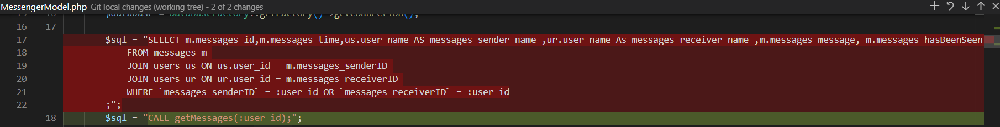

# Stored Procedures
## Angabe
```
Sämtliche Datenbankabfragen für den Nachrichtendienst (huge Framework) als „stored Procedures“ anlegen und anwenden
    • Es ist als erstes eine Liste sämtliche Abfragen zu erstellen
    • Zusammenfassen von Abfragen bei Bedarf
    • Erstellen der einzelnen Funktionen 
    • Integration der „stored Procedures“ ins huge Framework 

Dokumentation des Messenger Dienstes
```

## Lösung
### getMessages
#### Stored Procedure anlegen
- per phpMyAdmin
	- -> Routinen
	- Query aus Huge kopieren und beim erstellen der neuen Prcedure (Routine) einfügen
##### Exportierte Procedure
```SQL
DELIMITER $$
CREATE DEFINER=`root`@`localhost` PROCEDURE `getMessages`(IN `user_id` INT)
SELECT m.messages_id,m.messages_time,us.user_name AS messages_sender_name ,ur.user_name As messages_receiver_name ,m.messages_message, m.messages_hasBeenSeen 
            FROM messages m 
            JOIN users us ON us.user_id = m.messages_senderID 
            JOIN users ur ON ur.user_id = m.messages_receiverID 
            WHERE `messages_senderID` = user_id OR `messages_receiverID` = user_id$$
DELIMITER ;
```
#### model/MessengerModel.php
- Bisherige Query entfernen
- Query für Ausführung der stored Procedure einfügen

##### getMessages()
```php
    public static function getMessages()
    {
        $database = DatabaseFactory::getFactory()->getConnection();

        $sql = "CALL getMessages(:user_id);";
        $query = $database->prepare($sql);
        $query->execute(array(
            ':user_id' => Session::get('user_id')
        ));

        $user_messages = array();

        foreach ($query->fetchAll() as $message) {
            // all elements of array passed to Filter::XSSFilter for XSS sanitation, have a look into
            // application/core/Filter.php for more info on how to use. Removes (possibly bad) JavaScript etc from
            // the user's values
            array_walk_recursive($message, 'Filter::XSSFilter');

            $user_messages[$message->messages_id] = new stdClass();
            $user_messages[$message->messages_id]->messages_id = $message->messages_id;
            $user_messages[$message->messages_id]->messages_time = $message->messages_time;
            $user_messages[$message->messages_id]->messages_sender_name = $message->messages_sender_name;
            $user_messages[$message->messages_id]->messages_receiver_name = $message->messages_receiver_name;
            $user_messages[$message->messages_id]->messages_message = $message->messages_message;
            $user_messages[$message->messages_id]->messages_hasBeenSeen = $message->messages_hasBeenSeen;
        }
        return $user_messages;
    }
```

### writeNewMessage
#### Stored Procedure anlegen
```sql
DELIMITER $$
CREATE DEFINER=`root`@`localhost` PROCEDURE `writeNewMessage`(IN `senderID` INT, IN `receiverID` INT, IN `messageText` TEXT)
INSERT INTO `messages` (`messages_senderid`,`messages_receiverID`,`messages_message`)
                VALUES (senderID, receiverID, messageText)$$
DELIMITER ;
```
#### Model/MessengerModel.php
##### writeNewMessageToDatabase()
```php
public static function writeNewMessageToDatabase($senderID, $receiverID, $message)
    {
        $database = DatabaseFactory::getFactory()->getConnection();

        $sql = "CALL writeNewMessage(:senderID, :receiverID, :message_text);";
        $query = $database->prepare($sql);
        $succeeded = $query->execute(array(
            ':senderID' => $senderID,
            ':receiverID' => $receiverID,
            ':message_text' => $message
        ));
        return $succeeded;
    }
```
##### writeNewMessage()
```php
public static function writeNewMessage($sender_id, $receiver_name, $message_text)
    {
        // Check validity of inputs
        // clean the input
        $receiver_name = strip_tags($receiver_name);
        $message_text = strip_tags($message_text);

        // Does receiver exist?
        $receiver_id = UserModel::getUserIdByUsername($receiver_name);
        if(!$receiver_id){
            Session::add('feedback_negative', 
            "Fehler: getUserIdByUsername receiver_name: ".$receiver_name." receiverID: ".$receiver_id." -=- ".
            Text::get('FEEDBACK_USER_DOES_NOT_EXIST'
        ));
            return false;
        }

        // todo: check Sender ID
        
        
        // Write message to database
        MessengerModel::writeNewMessageToDatabase($sender_id, $receiver_id, $message_text);
        Session::add('feedback_positive', Text::get('FEEDBACK_MESSAGE_SENT'));
        return true;
    }
```
## Probleme
- Bei writeNewMessage hatte ich den Text als INT statt als TEXT erfasst. Dadurch war der Text der Nachrichten eine Zeit lang=0
- hatte bei writeNewMessage die Reihenfolge der Parameter vertauscht